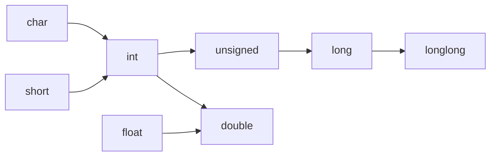

# 02 - 變數與資料型別

> 🎯 **學習目標**：理解 C 語言中的變數宣告與基本資料型別，學會使用 `printf` 進行格式化輸出。

---

## 變數（Variables）

變數是程式中用來**儲存資料**的命名空間。與 Python 不同，C 語言是**靜態型別**語言——每個變數在使用前都必須宣告其型別。

```c
#include <stdio.h>

int main() {
    // 語法：型別 變數名稱 = 初始值;
    int age = 25;           // 整數
    float height = 175.5;   // 浮點數（單精度）
    double pi = 3.14159;    // 浮點數（雙精度）
    char grade = 'A';       // 字元（注意使用單引號）

    printf("年齡：%d\n", age);
    printf("身高：%.1f 公分\n", height);
    printf("圓周率：%lf\n", pi);
    printf("成績：%c\n", grade);

    return 0;
}
```

### 變數命名規則

| 規則 | 說明 | 範例 |
|------|------|------|
| 只能包含字母、數字、底線 | 不允許空格或特殊符號 | `my_var`、`var1` |
| 不能以數字開頭 | 第一個字元必須是字母或底線 | ~~`1var`~~ ❌ |
| 區分大小寫 | `score` 和 `Score` 是不同的變數 | |
| 不能使用保留字 | C 語言的關鍵字不能用 | ~~`int`~~、~~`return`~~ ❌ |
| 建議使用底線命名法 | 單字之間用底線分隔 | `student_score` |

**保留字（關鍵字）範例**：`int`、`float`、`char`、`if`、`for`、`while`、`return`、`void`、`const` 等。

```c
// ✅ 好的命名
int student_age = 20;
float average_score = 85.5;
char first_initial = 'J';

// ❌ 不好的命名
int 2nd_place;       // 數字開頭
float my-height;      // 含連字號
int return;           // 使用了保留字
```

### 宣告 vs 初始化

```c
int x;          // 僅宣告（未初始化，x 的值是垃圾值）
x = 10;         // 賦值

int y = 10;     // 宣告＋初始化（建議做法）

int a, b, c;             // 一次宣告多個變數
int p = 1, q = 2, r = 3; // 一次宣告並初始化多個
```

> ⚠️ **注意**：C 語言中的**區域變數不會自動初始化**。使用未初始化的變數會得到不確定的「垃圾值」，這是常見的 bug 來源！

```c
#include <stdio.h>

int main() {
    int x;           // 未初始化，值不確定！
    printf("%d\n", x);  // ⚠️ 可能會印出奇怪的數字
    return 0;
}
```

---

## 基本資料型別

C 語言提供了以下基本資料型別：

| 型別 | 關鍵字 | 格式指定符 | 典型大小 | 數值範圍 |
|------|--------|-----------|---------|---------|
| 整數 | `int` | `%d` 或 `%i` | 4 bytes | -2⁷¹ ~ 2⁷¹-1 |
| 字元 | `char` | `%c` | 1 byte | -128 ~ 127 |
| 單精度浮點數 | `float` | `%f` | 4 bytes | ±1.2×10⁻³⁸ ~ ±3.4×10³⁸ |
| 雙精度浮點數 | `double` | `%lf` | 8 bytes | ±2.2×10⁻³⁰⁸ ~ ±1.8×10³⁰⁸ |
| 無型別 | `void` | — | 0 bytes | 無 |

### 整數（int）

```c
#include <stdio.h>

int main() {
    int a = 42;
    int b = -100;
    int sum = a + b;

    printf("a = %d\n", a);
    printf("b = %d\n", b);
    printf("a + b = %d\n", sum);

    // 不同進位的寫法
    int decimal = 255;        // 十進位
    int octal = 0377;         // 八進位（以 0 開頭）
    int hex = 0xFF;           // 十六進位（以 0x 開頭）

    printf("十進位：%d\n", decimal);
    printf("八進位：%o\n", octal);     // %o 以八進位輸出
    printf("十六進位：%x\n", hex);     // %x 以十六進位輸出（小寫）
    printf("十六進位：%X\n", hex);     // %X 以十六進位輸出（大寫）

    return 0;
}
```

> 💡 **提示**：可以使用 `%d` 輸出十進位、`%o` 輸出八進位、`%x` 或 `%X` 輸出十六進位。

### 浮點數（float 與 double）

```c
#include <stdio.h>

int main() {
    float f = 3.14159f;        // float 常數建議加 f 後綴
    double d = 3.141592653589793;  // double 是預設的浮點數型別

    printf("float:   %f\n", f);        // 預設顯示 6 位小數
    printf("float:   %.10f\n", f);     // 顯示 10 位小數（精度不足）
    printf("double:  %lf\n", d);       // %lf 輸出 double
    printf("double:  %.15lf\n", d);    // 顯示 15 位小數

    // 科學記號表示法
    double speed_of_light = 2.998e8;   // 2.998 × 10⁸
    double electron_mass = 9.11e-31;   // 9.11 × 10⁻³¹

    printf("光速：%e m/s\n", speed_of_light);
    printf("電子質量：%e kg\n", electron_mass);

    return 0;
}
```

> ⚠️ **注意**：`float` 的精度約 6-7 位有效數字，`double` 約 15-16 位。需要高精度計算時請使用 `double`。

### 字元（char）

C 語言中的 `char` 實際上是一個**整數**，儲存的是字元的 **ASCII 碼**。

```c
#include <stdio.h>

int main() {
    char ch1 = 'A';        // 字元常數使用單引號
    char ch2 = 65;         // 直接給 ASCII 碼（A 的 ASCII 碼是 65）

    printf("ch1 = %c\n", ch1);   // 輸出：A
    printf("ch2 = %c\n", ch2);   // 輸出：A
    printf("ch1 的 ASCII 碼：%d\n", ch1);  // 輸出：65

    // 字元可以進行算術運算
    char lowercase = 'a';
    char uppercase = lowercase - 32;  // 小寫轉大寫

    printf("%c 轉大寫 = %c\n", lowercase, uppercase);

    // 跳脫字元
    printf("換行：第一行\n第二行\n");
    printf("Tab：欄1\t欄2\t欄3\n");
    printf("反斜線：\\\n");
    printf("雙引號：\"Hello\"\n");

    return 0;
}
```

**常用 ASCII 碼對照**：

| 字元 | ASCII 碼 |
|------|---------|
| `'0'` ~ `'9'` | 48 ~ 57 |
| `'A'` ~ `'Z'` | 65 ~ 90 |
| `'a'` ~ `'z'` | 97 ~ 122 |
| `'\n'`（換行） | 10 |
| `'\0'`（空字元） | 0 |
| 空白字元 `' '` | 32 |

---

## 型別修飾詞

C 語言提供了四種修飾詞，用來調整基本型別的範圍：

| 修飾詞 | 說明 | 搭配型別 |
|--------|------|---------|
| `short` | 縮小整數範圍 | `int` |
| `long` | 擴大整數或浮點數範圍 | `int`、`double` |
| `unsigned` | 僅儲存正數（含 0） | `int`、`char`、`short`、`long` |
| `signed` | 可儲存正負數（預設值） | `int`、`char` |

```c
#include <stdio.h>

int main() {
    short int s = 32767;          // short int（可省略 int）
    long int l = 2147483647L;     // long int（建議加 L 後綴）
    long long ll = 9223372036854775807LL;  // long long
    unsigned int u = 4000000000U;    // 無號整數

    unsigned char uc = 200;       // 0 ~ 255
    signed char sc = -100;        // -128 ~ 127

    printf("short:         %d\n", s);
    printf("long:          %ld\n", l);
    printf("long long:     %lld\n", ll);
    printf("unsigned int:  %u\n", u);
    printf("unsigned char: %u\n", uc);

    return 0;
}
```

### 各型別的大小與範圍

使用 `sizeof` 運算子可以得知型別在當前系統上佔用的位元組數：

```c
#include <stdio.h>

int main() {
    printf("型別大小（bytes）：\n");
    printf("char:           %zu\n", sizeof(char));
    printf("short:          %zu\n", sizeof(short));
    printf("int:            %zu\n", sizeof(int));
    printf("long:           %zu\n", sizeof(long));
    printf("long long:      %zu\n", sizeof(long long));
    printf("float:          %zu\n", sizeof(float));
    printf("double:         %zu\n", sizeof(double));
    printf("long double:    %zu\n", sizeof(long double));

    // sizeof 也可以用在變數上
    int x = 10;
    printf("x 的大小：%zu\n", sizeof(x));

    return 0;
}
```

---

## const 常數

使用 `const` 關鍵字宣告不可修改的常數：

```c
#include <stdio.h>

int main() {
    const double PI = 3.14159;
    const int MAX_STUDENTS = 30;

    // PI = 3.14;         // ❌ 錯誤：不能修改 const 變數
    // MAX_STUDENTS = 50; // ❌ 錯誤

    int radius = 10;
    double area = PI * radius * radius;

    printf("半徑 %d 的圓面積 = %.2f\n", radius, area);

    return 0;
}
```

> 💡 **提示**：使用 `#define` 也可以定義常數，但 `const` 有型別檢查，更安全。

```c
#define PI 3.14159          // 前置處理器常數（無型別）
const double PI = 3.14159;  // 型別安全的常數（建議使用）
```

---

## printf 格式指定符完整對照

| 格式指定符 | 對應型別 | 說明 |
|-----------|---------|------|
| `%d` 或 `%i` | `int` | 十進位整數 |
| `%u` | `unsigned int` | 無號十進位整數 |
| `%f` | `float` / `double` | 十進位浮點數 |
| `%lf` | `double` | 雙精度浮點數 |
| `%Lf` | `long double` | 長雙精度浮點數 |
| `%c` | `char` | 單一字元 |
| `%s` | `char[]` | 字串 |
| `%x` / `%X` | `int` | 十六進位（小寫/大寫） |
| `%o` | `int` | 八進位 |
| `%p` | `void*` | 指標（記憶體位址） |
| `%e` / `%E` | `double` | 科學記號 |
| `%g` / `%G` | `double` | 自動選擇 %f 或 %e |
| `%zu` | `size_t` | sizeof 回傳型別 |
| `%%` | — | 印出百分比符號 |

### printf 格式修飾

```c
#include <stdio.h>

int main() {
    int num = 255;
    double pi = 3.1415926535;

    // 寬度與對齊
    printf("右對齊：|%10d|\n", num);       // 寬度 10，預設右對齊
    printf("左對齊：|%-10d|\n", num);      // 左對齊
    printf("補零：  |%010d|\n", num);      // 補零

    // 浮點數精度
    printf("預設：    %lf\n", pi);
    printf("2 位：    %.2lf\n", pi);
    printf("4 位：    %.4lf\n", pi);
    printf("10 位：   %.10lf\n", pi);

    // 混合使用
    printf("|%10.4lf|\n", pi);     // 寬度 10，小數 4 位
    printf("|%-10.4lf|\n", pi);    // 左對齊，寬度 10，小數 4 位

    return 0;
}
```

---

## scanf 格式化輸入

到目前為止，我們都用 `printf`「輸出」資料到螢幕。要讓程式「讀取」使用者的輸入，可以使用 `scanf`——C 語言中最基本的輸入函式。

### 基本用法

```c
#include <stdio.h>

int main() {
    int age;
    double height;
    char grade;

    // 提示使用者輸入
    printf("請輸入你的年齡：");
    scanf("%d", &age);          // %d 讀取整數，&age 表示「age 的位址」

    printf("請輸入你的身高（公分）：");
    scanf("%lf", &height);      // %lf 讀取 double

    printf("請輸入你的成績等第：");
    scanf(" %c", &grade);       // %c 讀取字元（注意前面的空格，用來吸收換行字元）

    printf("\n=== 你的資料 ===\n");
    printf("年齡：%d 歲\n", age);
    printf("身高：%.1f 公分\n", height);
    printf("成績：%c\n", grade);

    return 0;
}
```

> 💡 **提示**：`&` 是「取址運算子」，用來取得變數的記憶體位址。`scanf` 需要知道變數的位址才能把讀入的值存入變數——這與指標的概念有關，我們會在第六章深入探討。

### 為什麼 scanf 需要 `&`？

C 語言是**傳值呼叫（call by value）**——函式只能拿到變數的「值」，無法修改原變數。`scanf` 必須知道變數在記憶體中的**位置**（位址），才能把輸入的資料寫入那個位置。

```c
int x;
scanf("%d", &x);   // ✅ 傳入 x 的位址，scanf 可以修改 x
scanf("%d", x);    // ❌ 錯誤！傳入 x 的值（尚未初始化，是垃圾值）
```

> ⚠️ **初學者最常見的錯誤**：忘記在變數前面加 `&`！如果你的程式在執行時當機或出現奇怪的行為，第一個檢查的就是 `scanf` 的參數是否都加了 `&`。

### 常見格式指定符

| 格式指定符 | 對應型別 | 說明 |
|-----------|---------|------|
| `%d` | `int*` | 十進位整數 |
| `%i` | `int*` | 整數（可辨識八進位 `0`、十六進位 `0x` 前綴） |
| `%u` | `unsigned int*` | 無號整數 |
| `%ld` | `long*` | long 整數 |
| `%lld` | `long long*` | long long 整數 |
| `%f` | `float*` | 單精度浮點數 |
| `%lf` | `double*` | 雙精度浮點數 |
| `%c` | `char*` | 單一字元 |
| `%s` | `char[]` | 字串（不需 `&`，因為陣列名稱本身就是位址） |
| `%x` | `int*` | 十六進位整數 |

### 一次讀取多個值

```c
#include <stdio.h>

int main() {
    int a, b;
    printf("請輸入兩個整數（用空格分隔）：");
    scanf("%d %d", &a, &b);     // 一次讀取兩個整數

    printf("你輸入的是：%d 和 %d\n", a, b);
    printf("兩數之和：%d\n", a + b);

    return 0;
}
```

### scanf 的陷阱與注意事項

#### 1️⃣ 字元輸入的換行問題

```c
#include <stdio.h>

int main() {
    int num;
    char ch;

    printf("請輸入一個整數：");
    scanf("%d", &num);          // 輸入 42 後按 Enter，緩衝區留下 '\n'

    printf("請輸入一個字元：");
    scanf("%c", &ch);           // ❌ 會讀到上一個輸入留下的 '\n'！

    printf("整數：%d, 字元：'%c'\n", num, ch);  // ch 是換行，不會讓你輸入

    return 0;
}
```

**解決方法**：在 `%c` 前面加一個空格，讓 scanf 跳過空白字元：

```c
scanf(" %c", &ch);   // ✅ 空格會跳過任何空白（包括換行、空格、Tab）
```

#### 2️⃣ 字串輸入的長度限制

```c
char name[10];
scanf("%s", name);    // 如果輸入超過 9 個字元，會造成緩衝區溢位！

// 安全寫法：限制最大讀取長度
scanf("%9s", name);   // 最多讀取 9 個字元（保留 1 byte 給 '\0'）
```

#### 3️⃣ 檢查 scanf 是否成功

`scanf` 會回傳成功讀取的項目數量，可以利用這個來做錯誤檢查：

```c
#include <stdio.h>

int main() {
    int age;
    printf("請輸入年齡：");

    if (scanf("%d", &age) != 1) {
        printf("輸入無效！請輸入整數。\n");
        return 1;  // 程式結束，回傳錯誤碼
    }

    printf("你的年齡是：%d\n", age);
    return 0;
}
```

### fgets 的簡單介紹

由於 `scanf` 在處理字串和特殊格式時較麻煩，實務上常用 `fgets` 讀取整行，再用 `sscanf` 解析：

```c
#include <stdio.h>

int main() {
    char buffer[100];
    int age;

    printf("請輸入你的年齡：");
    fgets(buffer, sizeof(buffer), stdin);   // 讀取整行
    sscanf(buffer, "%d", &age);              // 從字串解析整數

    printf("你的年齡是：%d 歲\n", age);

    return 0;
}
```

> 💡 `fgets` 的優勢在於：不會殘留換行字元問題、可以完整讀取含空格的句子、更容易做錯誤處理。

---

## 型別轉換（Type Conversion）

### 隱式轉換（Implicit Conversion）

編譯器自動進行的型別轉換：

```c
#include <stdio.h>

int main() {
    int a = 5;
    double b = 2.5;

    double result = a + b;  // a 自動轉成 double，結果是 7.5
    printf("結果：%lf\n", result);

    int x = 10;
    int y = 3;
    double z = x / y;       // ❌ 整數除法！10/3 = 3（不是 3.333）
    printf("x / y = %lf\n", z);  // 輸出 3.000000

    double w = (double)x / y;    // ✅ 先轉 double 再除
    printf("(double)x / y = %lf\n", w);  // 輸出 3.333333

    return 0;
}
```

### 顯式轉換（Explicit Cast）

使用 `(型別)` 強制轉換：

```c
#include <stdio.h>

int main() {
    double d = 3.99;
    int i = (int)d;             // 小數部分被截斷
    printf("(int)%lf = %d\n", d, i);  // 輸出 3

    char ch = (char)65;         // int → char
    printf("(char)65 = %c\n", ch);    // 輸出 A

    // 運算中的轉換
    int students = 25;
    int total = 80;
    double percentage = (double)students / total * 100;
    printf("百分比：%.2f%%\n", percentage);

    return 0;
}
```

### 型別轉換規則（整數提升）



當不同型別混合運算時，較小的型別會自動提升為較大的型別。

---

## 常見錯誤與陷阱

### 1️⃣ 溢位（Overflow）

```c
#include <stdio.h>
#include <limits.h>  // 提供 INT_MAX 等常數

int main() {
    int max = INT_MAX;      // 2147483647
    printf("最大值：%d\n", max);
    printf("加 1：  %d\n", max + 1);   // ❌ 溢位！變成 -2147483648

    unsigned int u = 0;
    printf("0 - 1 = %u\n", u - 1);     // ❌ 繞回變成 4294967295

    return 0;
}
```

### 2️⃣ 整數除法

```c
int a = 5;
int b = 2;
double c = a / b;     // 2.0，不是 2.5！
double d = a / 2.0;   // 2.5 ✅
```

### 3️⃣ unsigned 的陷阱

```c
unsigned int u = 10;
int i = -20;

if (u + i > 0) {      // ⚠️ 因為 unsigned 轉換，-20 變成很大的正數
    printf("結果大於 0\n");  // 這行會執行！
}
```

---

## 本章重點整理

| 概念 | 重點 |
|------|------|
| 靜態型別 | 使用前必須宣告型別 |
| 基本型別 | `int`、`float`、`double`、`char`、`void` |
| 修飾詞 | `short`、`long`、`unsigned`、`signed` |
| `sizeof` | 取得型別或變數佔用的位元組數 |
| `const` | 宣告不可修改的常數 |
| `printf` | 使用格式指定符控制輸出格式 |
| 型別轉換 | 隱式轉換（自動）與顯式轉換（手動 cast） |

---

## 練習題

### 練習 1：個人資料卡

宣告變數儲存你的姓名（字元）、年齡（整數）、身高（浮點數），並用 `printf` 輸出：

```
姓名：小明
年齡：20 歲
身高：175.5 公分
```

### 練習 2：華氏轉攝氏

撰寫程式，將華氏溫度 98.6 度轉換為攝氏溫度。

公式：`C = (F - 32) * 5 / 9`

**提示**：注意整數除法的問題！

### 練習 3：資料型別大小

使用 `sizeof` 輸出你電腦上所有基本型別的大小（char、short、int、long、long long、float、double），並加上對應的格式指定符說明。

### 練習 4：圓面積計算

宣告 `const double PI = 3.14159`，讓使用者輸入半徑（先寫死在程式碼中），計算並輸出圓面積與圓周長。

---

準備好後，前往 [第三章：流程控制](./03-流程控制) 繼續學習！🚀
