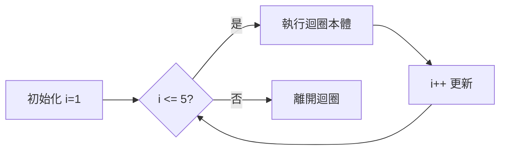

# 03 - 流程控制

> 🎯 **學習目標**：掌握條件判斷、迴圈與跳躍陳述，讓程式能根據不同情況做出決策。

---

## 條件判斷（if / else if / else）

### if 基本語法

C 語言的 `if` 語法與 Python 非常相似，但使用**括號**包住條件，並使用**大括號 `{}`** 包住程式區塊：

```c
#include <stdio.h>

int main() {
    int age = 18;

    if (age >= 18) {
        printf("你已經成年了！\n");
        printf("可以投票。\n");
    }

    return 0;
}
```

### if / else

```c
#include <stdio.h>

int main() {
    int score = 85;

    if (score >= 60) {
        printf("及格！\n");
    } else {
        printf("不及格，再接再厲！\n");
    }

    return 0;
}
```

### if / else if / else

```c
#include <stdio.h>

int main() {
    int score = 85;

    if (score >= 90) {
        printf("等級：A\n");
    } else if (score >= 80) {
        printf("等級：B\n");
    } else if (score >= 70) {
        printf("等級：C\n");
    } else if (score >= 60) {
        printf("等級：D\n");
    } else {
        printf("等級：F\n");
    }

    return 0;
}
```

### 巢狀 if

```c
#include <stdio.h>

int main() {
    int age = 20;
    int has_id = 1;   // 1 代表 true，0 代表 false

    if (age >= 18) {
        if (has_id) {
            printf("可以進入\n");
        } else {
            printf("需要出示證件\n");
        }
    } else {
        printf("未滿 18 歲，禁止進入\n");
    }

    return 0;
}
```

### 懸吊 else（Dangling Else）問題

```c
// ❌ 容易混淆的寫法
if (x > 0)
    if (y > 0)
        printf("x 和 y 都大於 0\n");
else
    printf("x 不大於 0\n");

// ✅ 清楚加上大括號
if (x > 0) {
    if (y > 0) {
        printf("x 和 y 都大於 0\n");
    }
} else {
    printf("x 不大於 0\n");
}
```

> ⚠️ **注意**：C 語言中，`else` 總是與最近的 `if` 配對。**永遠使用大括號**可以避免這個問題。

---

## switch-case 陳述

當條件是**單一變數的多個固定值**時，`switch-case` 比 `if-else` 更清晰：

```c
#include <stdio.h>

int main() {
    int day = 3;

    switch (day) {
        case 1:
            printf("星期一\n");
            break;
        case 2:
            printf("星期二\n");
            break;
        case 3:
            printf("星期三\n");
            break;
        case 4:
            printf("星期四\n");
            break;
        case 5:
            printf("星期五\n");
            break;
        case 6:
            printf("星期六\n");
            break;
        case 7:
            printf("星期日\n");
            break;
        default:
            printf("無效的日期\n");
    }

    return 0;
}
```

### switch-case 規則

| 規則 | 說明 |
|------|------|
| 條件只能是整數或字元 | `int`、`char`、`enum`，不能是 `float` 或字串 |
| 每個 case 建議加 `break` | 否則會發生 **fall-through**（繼續執行下一個 case） |
| `default` 可省略 | 處理所有未匹配的情況，通常放在最後 |

### Fall-through 的行為

```c
#include <stdio.h>

int main() {
    int month = 2;

    switch (month) {
        case 12:
        case 1:
        case 2:
            printf("冬季\n");
            break;
        case 3:
        case 4:
        case 5:
            printf("春季\n");
            break;
        case 6:
        case 7:
        case 8:
            printf("夏季\n");
            break;
        case 9:
        case 10:
        case 11:
            printf("秋季\n");
            break;
        default:
            printf("無效的月份\n");
    }

    return 0;
}
```

> 💡 **提示**：故意利用 fall-through 可以讓程式更簡潔，如上例中的季節判斷。

---

## 比較與邏輯運算子

### 比較運算子

| 運算子 | 意義 | 範例 | 結果 |
|--------|------|------|------|
| `==` | 等於 | `5 == 5` | `1`（true） |
| `!=` | 不等於 | `5 != 3` | `1`（true） |
| `<` | 小於 | `3 < 5` | `1`（true） |
| `>` | 大於 | `5 > 3` | `1`（true） |
| `<=` | 小於等於 | `5 <= 5` | `1`（true） |
| `>=` | 大於等於 | `3 >= 5` | `0`（false） |

### 邏輯運算子

| 運算子 | 意義 | 說明 |
|--------|------|------|
| `&&` | AND（且） | 兩個條件都為 true 才成立 |
| `\|\|` | OR（或） | 至少一個條件為 true 就成立 |
| `!` | NOT（反） | 將 true 變 false，false 變 true |

```c
#include <stdio.h>

int main() {
    int age = 20;
    int has_license = 1;
    int is_alcohol = 0;

    // &&（且）
    if (age >= 18 && has_license) {
        printf("可以開車\n");
    }

    // ||（或）
    if (age >= 18 || has_license) {
        printf("至少符合一個條件\n");
    }

    // !（反）
    if (!is_alcohol) {
        printf("不是酒精飲料，可以購買\n");
    }

    // 短路求值（Short-circuit）
    int a = 0;
    int b = 5;

    if (a != 0 && b / a > 2) {  // ❌ a=0 時 b/a 會除零！
        printf("不會執行到這裡\n");
    }
    // 實際上 && 的左邊是 false，右邊根本不會執行 ── 這就是短路求值
    printf("安全通過！\n");

    return 0;
}
```

> ⚠️ **注意**：千萬不要將 `=`（指派）和 `==`（比較）搞混！`if (x = 5)` 永遠為 true，因為指派運算式的值就是 5（非零即 true）。

```c
int x = 0;

// ❌ 錯誤：指派而非比較
if (x = 5) {
    printf("這行程式永遠會執行！\n");  // x=5 的值是 5（非零= true）
}

// ✅ 正確：使用 == 比較
if (x == 5) {
    printf("x 等於 5\n");
}
```

> 💡 **提示**：養成將常數寫在左邊的習慣可以避免這個錯誤：`if (5 == x)`。如果你打成 `if (5 = x)`，編譯器會報錯。

---

## for 迴圈

當你**知道要重複執行幾次**時，使用 `for` 迴圈：

```c
#include <stdio.h>

int main() {
    // 語法：for (初始值; 條件; 更新)
    for (int i = 1; i <= 5; i++) {
        printf("第 %d 次迴圈\n", i);
    }

    return 0;
}
```

執行流程：



### for 迴圈範例

```c
#include <stdio.h>

int main() {
    // 計算 1 到 100 的總和
    int sum = 0;
    for (int i = 1; i <= 100; i++) {
        sum += i;
    }
    printf("1 + 2 + ... + 100 = %d\n", sum);

    // 倒數計數
    for (int i = 10; i >= 1; i--) {
        printf("%d ", i);
    }
    printf("發射！\n");

    // 跳躍計數（步長為 2）
    for (int i = 0; i <= 10; i += 2) {
        printf("%d ", i);
    }
    printf("\n");

    // 巢狀迴圈：九九乘法表
    for (int i = 1; i <= 9; i++) {
        for (int j = 1; j <= 9; j++) {
            printf("%d×%d=%-2d ", i, j, i * j);
        }
        printf("\n");
    }

    return 0;
}
```

### for 迴圈的特殊寫法

```c
// 省略初始值
int i = 0;
for (; i < 5; i++) { ... }

// 省略條件（無窮迴圈）
for (int i = 0; ; i++) {
    if (i > 100) break;  // 需手動 break
}

// 省略更新
for (int i = 0; i < 5; ) {
    i++;  // 在迴圈內更新
}

// 完全省略（無窮迴圈）
for (;;) {
    printf("無窮迴圈\n");
}
```

---

## while 迴圈

當**不確定執行次數，但知道繼續條件**時，使用 `while`：

```c
#include <stdio.h>

int main() {
    int num = 12345;
    int count = 0;

    // 計算 num 有幾位數
    while (num > 0) {
        num /= 10;   // num = num / 10
        count++;
    }
    printf("位數：%d\n", count);

    return 0;
}
```

### while 範例：最大公因數（輾轉相除法）

```c
#include <stdio.h>

int main() {
    int a = 48, b = 18;

    printf("%d 和 %d 的", a, b);
    while (b != 0) {
        int temp = b;
        b = a % b;
        a = temp;
    }
    printf("最大公因數 = %d\n", a);

    return 0;
}
```

---

## do-while 迴圈

`do-while` 保證**至少執行一次**，條件在結尾檢查：

```c
#include <stdio.h>

int main() {
    int password;
    int correct = 1234;

    do {
        printf("請輸入密碼：");
        scanf("%d", &password);

        if (password != correct) {
            printf("密碼錯誤！\n");
        }
    } while (password != correct);

    printf("登入成功！\n");

    return 0;
}
```

### while vs do-while

```c
// while：可能一次都不執行
int x = 100;
while (x < 10) {
    printf("不會執行\n");  // x=100，條件不成立
}

// do-while：至少執行一次
int y = 100;
do {
    printf("會執行一次\n");  // 先做再說！
} while (y < 10);
```

---

## break 與 continue

### break：跳出迴圈

```c
#include <stdio.h>

int main() {
    // 尋找第一個 3 的倍數
    for (int i = 1; i <= 10; i++) {
        if (i % 3 == 0) {
            printf("第一個 3 的倍數是 %d\n", i);
            break;  // 跳出整個 for 迴圈
        }
    }

    // break 在巢狀迴圈中只會跳出一層
    for (int i = 1; i <= 3; i++) {
        for (int j = 1; j <= 3; j++) {
            if (i * j > 4) {
                break;  // 只跳出內層 j 迴圈
            }
            printf("(%d,%d) ", i, j);
        }
        printf("\n");
    }

    return 0;
}
```

### continue：跳過本次迭代

```c
#include <stdio.h>

int main() {
    // 只印出奇數
    for (int i = 1; i <= 10; i++) {
        if (i % 2 == 0) {
            continue;  // 偶數直接跳過，不執行後續敘述
        }
        printf("%d ", i);
    }
    printf("\n");

    // continue 在 while 中的陷阱
    int x = 0;
    while (x < 5) {
        if (x == 3) {
            continue;  // ❌ 跳過 x++，造成無窮迴圈！
        }
        x++;
    }

    return 0;
}
```

> ⚠️ **注意**：在 `while` 迴圈中使用 `continue` 要小心——如果 `continue` 跳過了更新變數的敘述，可能造成無窮迴圈。`for` 迴圈則沒有這個問題，因為更新在 `continue` 後仍會執行。

---

## 三元運算子（?:）

這是 C 語言中**唯一的 ternary 運算子**，是 `if-else` 的精簡版：

```c
#include <stdio.h>

int main() {
    int score = 85;

    // if-else 寫法
    char* result1;
    if (score >= 60) {
        result1 = "及格";
    } else {
        result1 = "不及格";
    }

    // 三元運算子（一行搞定）
    char* result2 = (score >= 60) ? "及格" : "不及格";

    printf("%s\n", result2);

    // 巢狀三元（不建議過度使用）
    int num = 0;
    char* sign = (num > 0) ? "正數" : (num < 0) ? "負數" : "零";
    printf("%d 是 %s\n", num, sign);

    return 0;
}
```

---

## goto（了解即可，避免使用）

C 語言支援 `goto`，但**強烈建議不要使用**，它會讓程式碼難以閱讀和維護：

```c
#include <stdio.h>

int main() {
    // goto 範例（僅供了解，實戰中請避免）
    for (int i = 1; i <= 10; i++) {
        for (int j = 1; j <= 10; j++) {
            if (i * j == 50) {
                goto found;  // 跳離多重迴圈
            }
        }
    }

found:
    printf("找到乘積為 50 的組合！\n");

    return 0;
}
```

> 💡 **提示**：`goto` 唯一合理的用途是**在多層巢狀迴圈中一次跳出**。但在現代 C 程式中，通常可以用 `return` 或 `flag` 變數替代。

---

## 常見陷阱整理

### 1️⃣ 忘記大括號

```c
// ❌ 沒有大括號，只有第一行屬於 if
if (score >= 60)
    printf("及格\n");
    printf("恭喜！\n");   // ← 這行永遠會執行！

// ✅ 使用大括號清楚界定區塊
if (score >= 60) {
    printf("及格\n");
    printf("恭喜！\n");
}
```

### 2️⃣ switch 忘記 break

```c
switch (x) {
    case 1:
        printf("一");
    case 2:        // ❌ 如果 x=1，這裡也會執行！
        printf("二");
        break;
}
```

### 3️⃣ 分號位置錯誤

```c
// ❌ for 後面多了分號
for (int i = 0; i < 5; i++); {   // ← 分號讓迴圈主體為空
    printf("%d ", i);             // 只執行一次
}

// ❌ while 後面多了分號
while (x < 5); {                  // ← 無窮迴圈或只執行一次
    x++;
}
```

### 4️⃣ 無窮迴圈

```c
int i = 0;
while (i < 10);  // ❌ 分號！無窮迴圈！
{
    i++;
}

// 修正
int i = 0;
while (i < 10) {
    i++;
}
```

---

## 本章重點整理

| 概念 | 重點 |
|------|------|
| `if / else if / else` | 條件判斷，永遠使用大括號 |
| `switch-case` | 多分支選擇，記得加 `break` |
| 比較運算子 | `==`、`!=`、`<`、`>`、`<=`、`>=` |
| 邏輯運算子 | `&&`、`\|\|`、`!`，有短路求值特性 |
| `for` | 已知次數的迴圈 |
| `while` | 條件控制的迴圈 |
| `do-while` | 至少執行一次的迴圈 |
| `break` | 跳出目前迴圈 |
| `continue` | 跳過本次迭代 |
| 三元運算子 | `條件 ? 值1 : 值2` |

---

## 練習題

### 練習 1：成績分級

撰寫程式，根據輸入的分數（0~100）輸出對應的等級：
- 90~100：A
- 80~89：B
- 70~79：C
- 60~69：D
- 0~59：F

### 練習 2：猜數字遊戲

程式設定一個 1~100 之間的數字，使用者重複猜測，直到猜中為止。每次猜測後提示「太大」或「太小」。

**提示**：使用 `while` 或 `do-while` 迴圈。

### 練習 3：質數判斷

輸入一個正整數，判斷它是否為質數。

**提示**：質數是大於 1 且只能被 1 和自己整除的數。檢查 2 到 sqrt(n) 之間是否有因數。

---

準備好後，前往 [第四章：函式](./04-函式) 繼續學習！🚀
