# 03 - 流程控制

> 🎯 **學習目標**：掌握條件判斷與迴圈控制，讓程式能夠根據不同情況做出決策。

## 條件判斷（if / elif / else）

### 基本 if 語法

```python
age = 18

if age >= 18:
    print("你已經成年了！")
    print("可以投票。")
```

### if / else 語法

```python
score = 85

if score >= 60:
    print("及格！")
else:
    print("不及格，再接再厲！")
```

### if / elif / else 語法

```python
score = 85

if score >= 90:
    grade = "A"
elif score >= 80:
    grade = "B"
elif score >= 70:
    grade = "C"
elif score >= 60:
    grade = "D"
else:
    grade = "F"

print(f"成績等級: {grade}")
```

### 巢狀條件判斷

```python
age = 20
has_id = True

if age >= 18:
    if has_id:
        print("可以進入")
    else:
        print("需要出示證件")
else:
    print("未滿 18 歲，禁止進入")
```

### 三元運算式

```python
# 一般寫法
age = 20
status = ""
if age >= 18:
    status = "成年"
else:
    status = "未成年"

# 三元運算式（一行搞定）
status = "成年" if age >= 18 else "未成年"
```

## 邏輯運算子

```python
# and（且）：兩個條件都為 True
age = 25
has_license = True
if age >= 18 and has_license:
    print("可以開車")

# or（或）：至少一個條件為 True
is_weekend = True
is_holiday = False
if is_weekend or is_holiday:
    print("放假囉！")

# not（反向）
is_rainy = False
if not is_rainy:
    print("今天不會下雨")
```

## 成員與身份運算子

```python
# in 成員運算子
fruits = ["蘋果", "香蕉", "橘子"]
print("蘋果" in fruits)      # True
print("葡萄" in fruits)      # False

# is 身份運算子（檢查是否為同一個物件）
a = [1, 2, 3]
b = [1, 2, 3]
c = a

print(a is c)     # True（同一個物件）
print(a is b)     # False（不同物件，但內容相同）
print(a == b)     # True（內容相同）
```

---

# 🔄 for 迴圈

`for` 迴圈是 Python 中用來**遍歷（iterate）可迭代物件**的核心工具。當你有一個集合（如列表、字串、range）並且想對其中的**每個元素依序執行相同操作**時，就使用 `for` 迴圈。

## for 迴圈的運作原理

### 執行流程圖

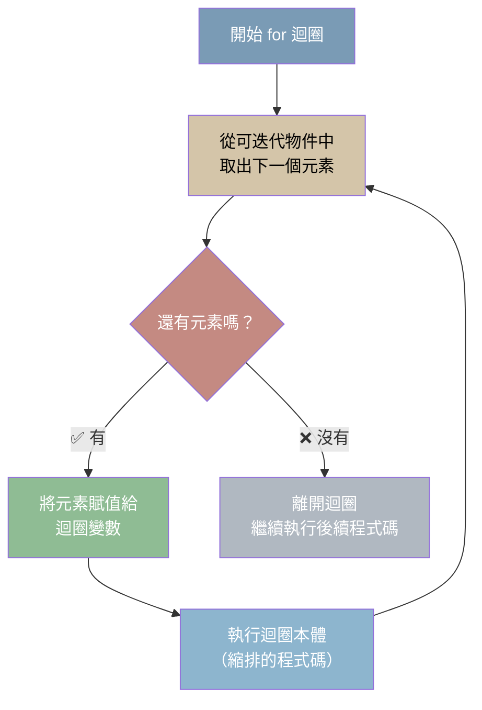

### 基本語法結構

```python
for 變數 in 可迭代物件:
    要重複執行的程式碼  # 縮排！
```

### 實際執行流程拆解

來看一個具體的例子，一步步追蹤程式的執行過程：

```python
fruits = ["蘋果", "香蕉", "橘子"]

for fruit in fruits:
    print(f"我喜歡吃 {fruit}")

print("迴圈結束！")
```

**步驟追蹤表：**

| 迭代次數 | `fruit` 的值 | 執行的動作 | `print()` 輸出 |
|:-------:|:------------:|-----------|:-------------:|
| 第 1 次 | `"蘋果"` | 取出第一個元素 → 輸出 | `我喜歡吃 蘋果` |
| 第 2 次 | `"香蕉"` | 取出第二個元素 → 輸出 | `我喜歡吃 香蕉` |
| 第 3 次 | `"橘子"` | 取出第三個元素 → 輸出 | `我喜歡吃 橘子` |
| 結束 | — | 沒有更多元素 → 退出迴圈 | `迴圈結束！` |

> 💡 **重點**：`for` 迴圈會自動依序取出每個元素，你**不需要手動管理索引**。迴圈結束後，元素就完全處理完畢了。

## range()：產生數列

`range()` 是 Python 內建的函式，用來產生一整串連續的數字，非常適合用來控制迴圈的次數。

### range() 的三種形態

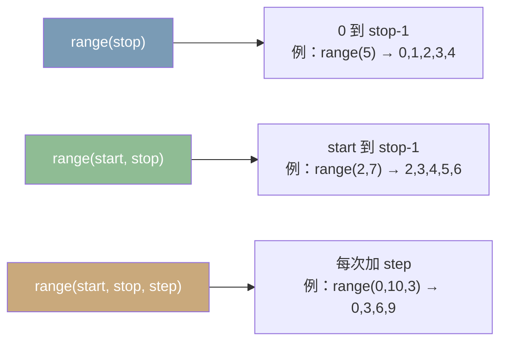

### 完整程式碼範例

```python
# 🔹 基本用法：指定結束值（從 0 開始）
for i in range(5):
    print(i, end=" ")
# 輸出: 0 1 2 3 4

# 🔹 指定起始值與結束值
for i in range(2, 8):
    print(i, end=" ")
# 輸出: 2 3 4 5 6 7

# 🔹 指定起始值、結束值與步長
for i in range(0, 10, 2):
    print(i, end=" ")
# 輸出: 0 2 4 6 8（步長為 2，每隔一個數字取一個）
```

### 視覺化圖解

```
range(5)       → [ 0   1   2   3   4 ]
                   └── 5 個數字（從 0 開始）

range(2, 7)    → [ 2   3   4   5   6 ]
                   └── 從 2 開始，到 7 之前結束

range(0, 10, 3) → [ 0   3   6   9 ]
                        └─┴─┴─┘── 每次加 3
```

### range() 參數對照表

| 呼叫方式 | 參數 | 產生的序列 | 使用情境 |
|---------|------|-----------|---------|
| `range(5)` | stop = 5 | 0, 1, 2, 3, 4 | 單純重複 N 次 |
| `range(1, 6)` | start=1, stop=6 | 1, 2, 3, 4, 5 | 從特定數字開始 |
| `range(0, 10, 2)` | start=0, stop=10, step=2 | 0, 2, 4, 6, 8 | 每隔幾個取一次 |
| `range(5, 0, -1)` | start=5, stop=0, step=-1 | 5, 4, 3, 2, 1 | 倒數計時！ |

```python
# 倒數計時範例
for i in range(5, 0, -1):
    print(f"倒數 {i} 秒...")
print("發射！🚀")
# 輸出:
# 倒數 5 秒...
# 倒數 4 秒...
# 倒數 3 秒...
# 倒數 2 秒...
# 倒數 1 秒...
# 發射！🚀
```

## 遍歷不同資料型態

### 1️⃣ 遍歷列表

```python
fruits = ["蘋果", "香蕉", "橘子", "葡萄", "西瓜"]

for fruit in fruits:
    print(f"🍎 我喜歡吃 {fruit}")
# 輸出:
# 🍎 我喜歡吃 蘋果
# 🍎 我喜歡吃 香蕉
# 🍎 我喜歡吃 橘子
# 🍎 我喜歡吃 葡萄
# 🍎 我喜歡吃 西瓜
```

### 2️⃣ 遍歷字串

```python
message = "Python"

for char in message:
    print(char, end=" ")
# 輸出: P y t h o n
# 字串中的每個「字元」就是一個元素
```

### 3️⃣ enumerate：同時取得索引與值

當你**同時需要元素的位置（索引）和元素本身**時，使用 `enumerate()`。

```python
fruits = ["蘋果", "香蕉", "橘子"]

for index, fruit in enumerate(fruits):
    print(f"第 {index + 1} 個水果是 {fruit}")

# 輸出:
# 第 1 個水果是 蘋果
# 第 2 個水果是 香蕉
# 第 3 個水果是 橘子
```

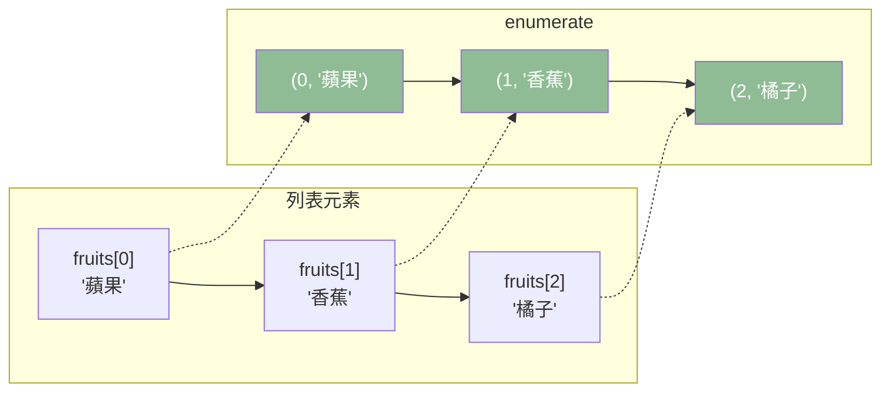

### 4️⃣ 遍歷字典

字典可以遍歷「鍵」、「值」或「鍵值對」：

```python
student = {
    "name": "Alice",
    "age": 20,
    "score": 95
}

# 方式一：遍歷鍵（keys）
for key in student:
    print(f"鍵: {key}")
# 鍵: name
# 鍵: age
# 鍵: score

# 方式二：遍歷值（values）
for value in student.values():
    print(f"值: {value}")
# 值: Alice
# 值: 20
# 值: 95

# 方式三：同時遍歷鍵與值（items）— 最常用！
for key, value in student.items():
    print(f"{key}: {value}")
# name: Alice
# age: 20
# score: 95
```

---

# 🔁 while 迴圈

`while` 迴圈是**條件驅動**的迴圈 — 只要條件成立，就會一直重複執行。

## while vs for 的核心差異

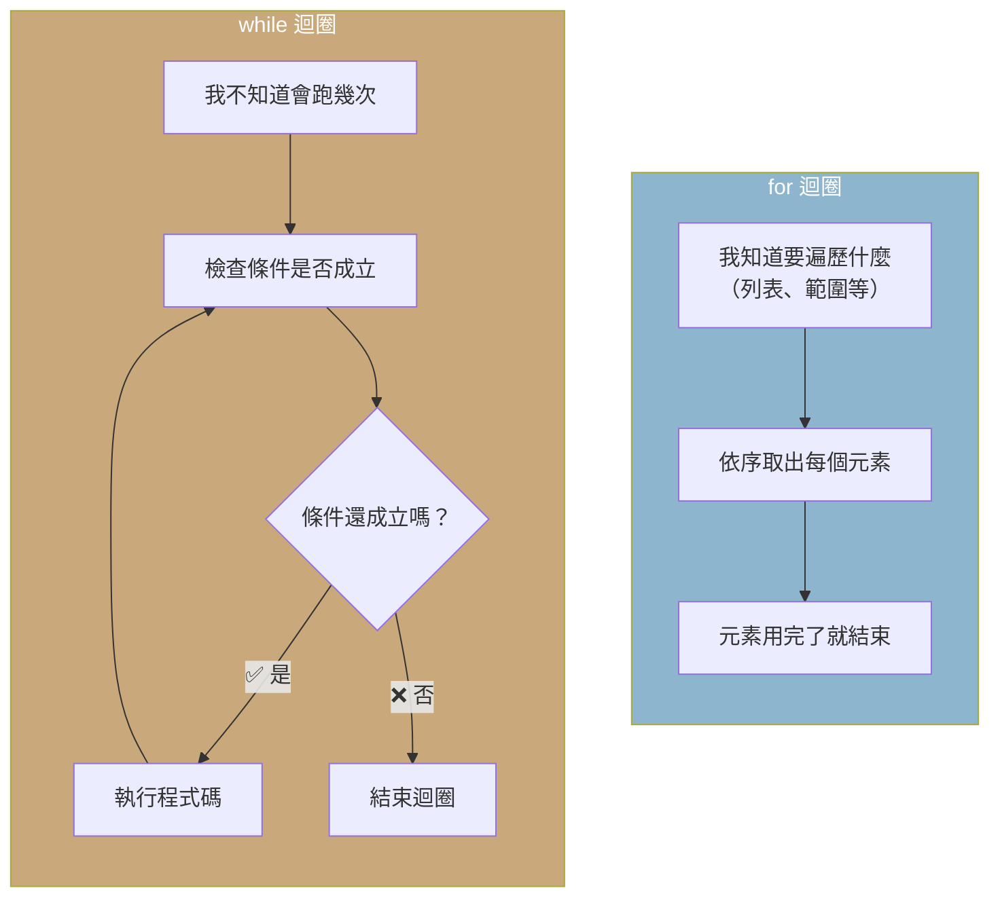

| 特性 | `for` 迴圈 | `while` 迴圈 |
|:----|:----------:|:-----------:|
| 使用時機 | 明確知道要遍歷的範圍 | 不確定會執行幾次 |
| 終止條件 | 元素遍歷完畢自動結束 | 需手動確保條件會變為 `False` |
| 風險 | 相對安全 | 容易寫出**無限迴圈** |
| 常見應用 | 遍歷列表、固定次數操作 | 等待使用者輸入、遊戲迴圈 |

## while 迴圈的運作原理

### 執行流程圖

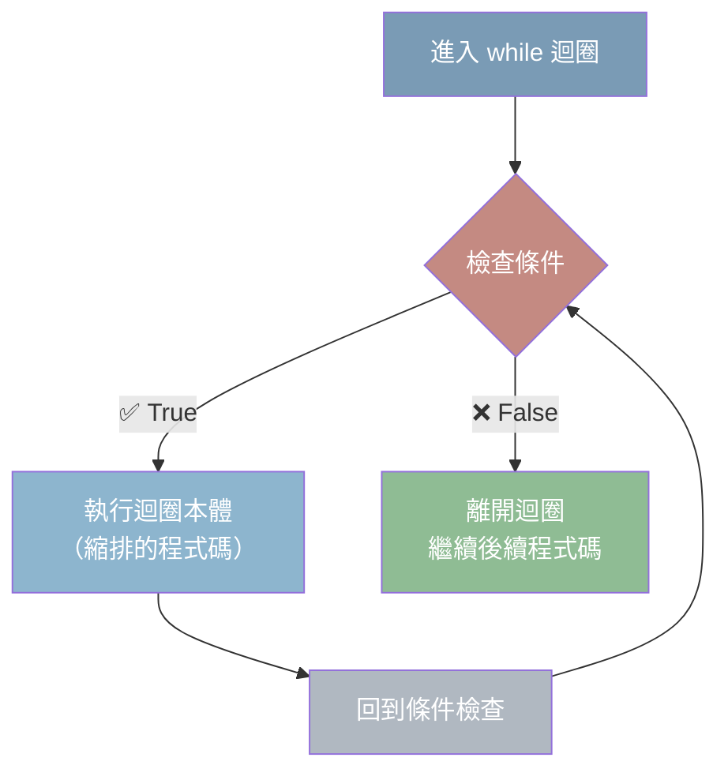

### 基本語法

```python
while 條件:
    要重複執行的程式碼  # 縮排！
    # 必須有某種方式讓條件最終變為 False
```

### 實際執行步驟拆解

```python
count = 0

while count < 5:
    print(f"計數: {count}")
    count += 1  # 這行很關鍵！讓條件最終會不成立

print("迴圈結束！")
```

**步驟追蹤表：**

| 迭代次數 | `count` 的值 | 條件 `count < 5` | 執行動作 | 輸出 |
|:-------:|:----------:|:----------------:|---------|:----:|
| 第 1 次 | 0 | `True` ✅ | 輸出 → `count` 加 1 | `計數: 0` |
| 第 2 次 | 1 | `True` ✅ | 輸出 → `count` 加 1 | `計數: 1` |
| 第 3 次 | 2 | `True` ✅ | 輸出 → `count` 加 1 | `計數: 2` |
| 第 4 次 | 3 | `True` ✅ | 輸出 → `count` 加 1 | `計數: 3` |
| 第 5 次 | 4 | `True` ✅ | 輸出 → `count` 加 1 | `計數: 4` |
| 第 6 次 | 5 | `False` ❌ | 不執行，退出迴圈 | `迴圈結束！` |

> ⚠️ **關鍵提醒**：`count += 1` 這行程式碼至關重要！如果忘了寫，`count` 永遠是 0，`count < 5` 永遠是 `True`，程式就會**永遠執行下去** — 這叫做**無限迴圈**。

## while 的經典應用場景

### 場景 1：不確定次數的輸入驗證

```python
while True:
    user_input = input("請輸入 'q' 離開: ")
    if user_input == 'q':
        print("再見！👋")
        break  # 跳出迴圈
    else:
        print(f"你輸入了 '{user_input}'，請輸入 q 才能離開")
```

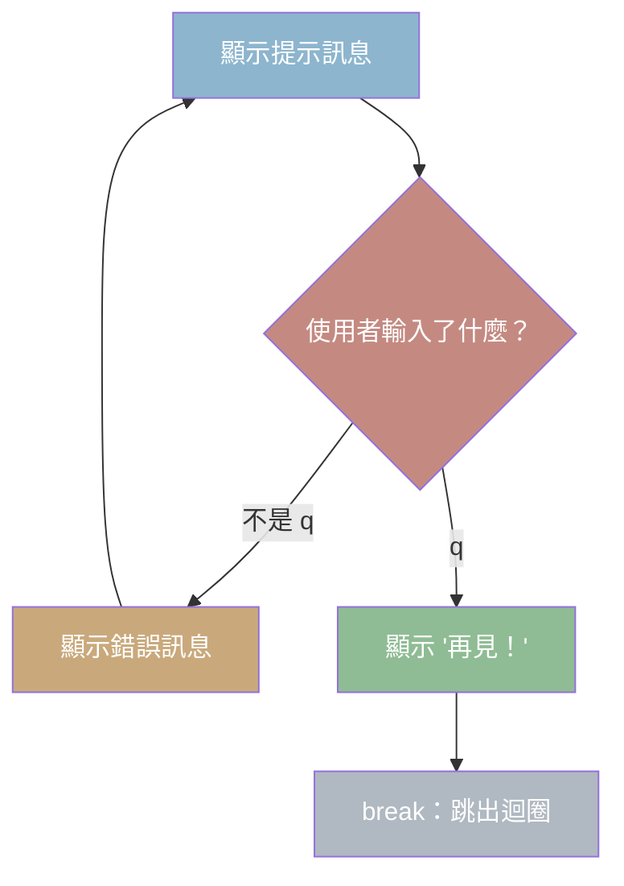

### 場景 2：逐步逼近目標值

```python
# 猜數字遊戲（核心邏輯）
import random

target = random.randint(1, 100)
guess = -1  # 確保第一次會進入迴圈

while guess != target:
    guess = int(input("猜一個數字 (1-100): "))
    
    if guess < target:
        print("太小了！")
    elif guess > target:
        print("太大了！")

print("🎉 恭喜你猜對了！")
```

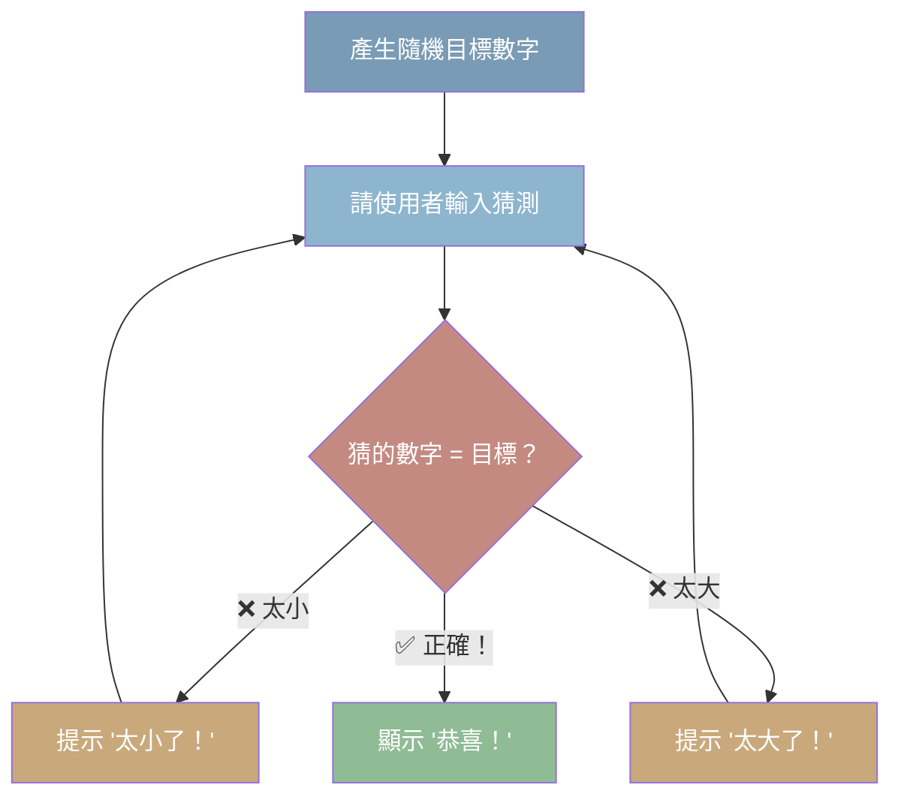

---

# 🚦 break 與 continue

`break` 和 `continue` 是迴圈中的「控制開關」，讓你可以更靈活地控制迴圈的執行流程。

## break：強制跳出整個迴圈

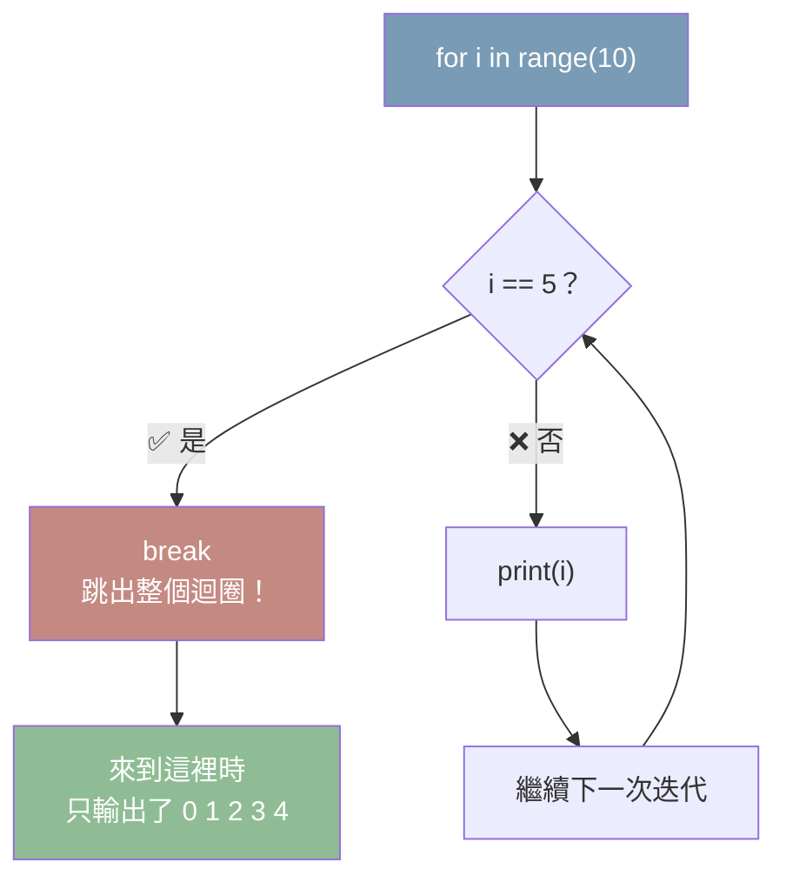

```python
# break 範例：找到目標就停止
for i in range(10):
    if i == 5:
        break          # 💥 強制終止整個迴圈
    print(i, end=" ")
# 輸出: 0 1 2 3 4
# 當 i = 5 時觸發 break，迴圈直接結束
```

```
執行過程圖解：
i:    0 → 1 → 2 → 3 → 4 → 5（觸發 break 💥）
輸出: 0   1   2   3   4   ⛔ 停止
```

## continue：跳過本次迭代

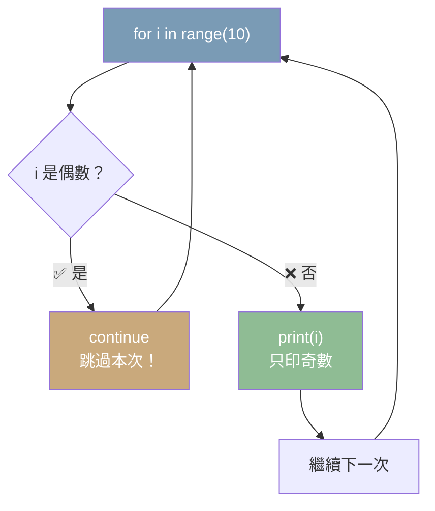

```python
# continue 範例：只處理奇數
for i in range(10):
    if i % 2 == 0:
        continue       # ➡️ 跳過偶數，回到下一輪
    print(i, end=" ")
# 輸出: 1 3 5 7 9
```

```
執行過程圖解：
i:    0 → 1 → 2 → 3 → 4 → 5 → 6 → 7 → 8 → 9
      跳過  印出  跳過  印出  跳過  印出  跳過  印出  跳過  印出
輸出:      1       3       5       7       9
```

## break vs continue 對照

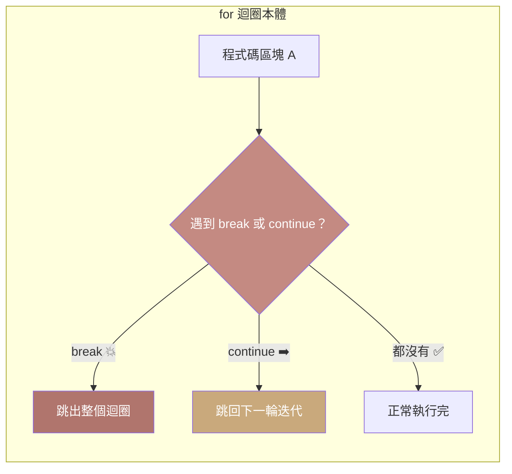

| 指令 | 效果 | 比喻 |
|:---:|------|------|
| `break` | 🔴 **完全終止**迴圈，跳到迴圈外面 | 就像看電影看到一半**離場** |
| `continue` | ⏭️ **跳過當前這一次**，繼續下一輪 | 就像看廣告時**快轉** |

## 實戰對比：兩個範例看差異

```python
# ──── break 範例 ────
print("break：找到 5 就停止")
for i in range(10):
    if i == 5:
        break
    print(i, end=" ")
# 輸出: 0 1 2 3 4
print("\n（迴圈被中斷了！）")

print()

# ──── continue 範例 ────
print("continue：跳過數字 5")
for i in range(10):
    if i == 5:
        continue
    print(i, end=" ")
# 輸出: 0 1 2 3 4 6 7 8 9
print("\n（只有 5 被跳過，其餘正常輸出）")
```

## for-else 與 while-else

這是一個 Python 獨特的語法 — `else` 區塊在**迴圈正常結束（沒有被 break）**時執行。

```python
# ──── for-else：沒有觸發 break → 執行 else ────
for i in range(5):
    print(i, end=" ")
else:
    print("\n✅ 迴圈正常結束")
# 輸出:
# 0 1 2 3 4
# ✅ 迴圈正常結束

# ──── 有 break → else 不執行 ────
for i in range(5):
    if i == 3:
        print(f"\n💥 在 i={i} 時 break")
        break
    print(i, end=" ")
else:
    print("這行不會執行")
# 輸出:
# 0 1 2
# 💥 在 i=3 時 break
```

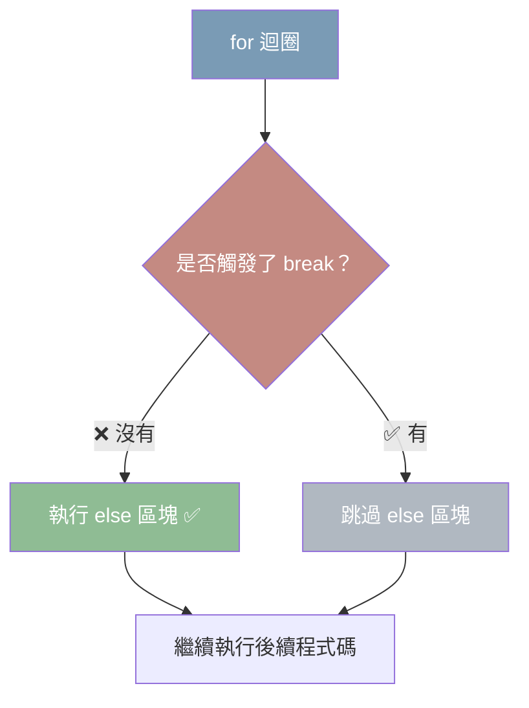

## 💡 列表推導式（List Comprehension）

列表推導式是 Python 中一種**用表達式來建立新列表**的簡潔語法，本質上就是 for 迴圈的進化版。

```python
# 🔹 傳統 for 迴圈寫法
squares = []
for x in range(10):
    squares.append(x ** 2)

# 🔹 列表推導式（一行搞定 👇）
squares = [x ** 2 for x in range(10)]

print(squares)  # [0, 1, 4, 9, 16, 25, 36, 49, 64, 81]
```

### 語法結構

```python
[表達式 for 變數 in 可迭代物件 if 條件]
```

| 部分 | 說明 | 是否必填 |
|:----|------|:-------:|
| `表達式` | 每個元素要執行的運算 | ✅ |
| `for 變數 in 可迭代物件` | 跟一般 for 迴圈一樣 | ✅ |
| `if 條件` | 過濾條件，只保留符合的元素 | ❌ |

### 逐步拆解

```python
# 範例：取 0-9 之間的偶數平方
result = [x ** 2 for x in range(10) if x % 2 == 0]
```

```
執行過程（等同於以下 for 迴圈）：
┌─────────────────────────────────────────────┐
│ result = []                                  │
│ for x in range(10):      # x = 0,1,2,...,9  │
│     if x % 2 == 0:       # 只取偶數          │
│         result.append(x ** 2)                │
└─────────────────────────────────────────────┘

x:     0 →  1 →  2 →  3 →  4 →  5 →  6 →  7 →  8 →  9
if:   ✅   ❌   ✅   ❌   ✅   ❌   ✅   ❌   ✅   ❌
x²:    0       4       16      36      64
output: [0, 4, 16, 36, 64]
```

### 更多範例

```python
# 基本：每個數字平方
[x ** 2 for x in range(6)]           # [0, 1, 4, 9, 16, 25]

# 加條件：只取偶數
[x ** 2 for x in range(10) if x % 2 == 0]  # [0, 4, 16, 36, 64]

# 轉換：字串轉大寫
words = ["hello", "world", "python"]
[w.upper() for w in words]           # ['HELLO', 'WORLD', 'PYTHON']

# 篩選：取及格分數
scores = [45, 82, 91, 33, 76, 60]
passed = [s for s in scores if s >= 60]
print(passed)                        # [82, 91, 76, 60]
```

## 練習題

1. **for 迴圈基礎**：使用 `for` 迴圈計算 1 到 100 的總和
2. **range 進階**：使用 `range()` 印出 100 以內的所有 7 的倍數
3. **for + enumerate**：有一個名字列表 `["Alice", "Bob", "Charlie"]`，使用 `enumerate` 印出「第 1 位: Alice」的格式
4. **while 應用**：使用 `while` 迴圈實作一個猜數字遊戲（隨機範圍 1-100）
5. **break 應用**：有一個數字列表，使用 `for` 迴圈找出第一個大於 50 的數字後就停止
6. **continue 應用**：印出 1 到 20 之間所有**不是 3 的倍數**的數字
7. **列表推導式**：使用列表推導式，從 `[1, 2, 3, 4, 5, 6, 7, 8, 9, 10]` 中篩選出所有 3 的倍數並乘以 10

---

> 💡 **下一章**：[函式](./04-函式)
