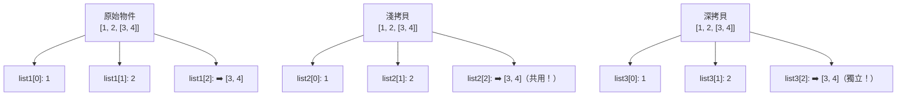

# 05 - 資料結構

> 🎯 **學習目標**：深入學習 Python 的四種內建資料結構，並了解如何選擇合適的資料結構。

## 列表（List）

列表是 Python 中最常用的資料結構，用 **中括號 `[]`** 表示，**有序**且**可變**。

### 建立與存取

```python
# 建立列表
numbers = [1, 2, 3, 4, 5]
fruits = ["蘋果", "香蕉", "橘子"]
mixed = [1, "Hello", 3.14, True]

# 索引存取（從 0 開始）
print(fruits[0])    # 蘋果
print(fruits[-1])   # 橘子（倒數第一個）

# 切片 [start:end:step]
print(numbers[1:4])   # [2, 3, 4]
print(numbers[::2])   # [1, 3, 5]（每隔一個取一個）
print(numbers[::-1])  # [5, 4, 3, 2, 1]（反轉）
```

### 常用方法

```python
fruits = ["蘋果", "香蕉"]

# 新增
fruits.append("橘子")      # 在末尾新增
fruits.insert(1, "葡萄")   # 在指定位置插入

# 刪除
fruits.pop()               # 移除並回傳最後一個
fruits.pop(1)              # 移除並回傳指定索引
fruits.remove("蘋果")      # 移除第一個符合的值
# del fruits[0]            # 刪除指定索引

# 其他操作
numbers = [3, 1, 4, 1, 5]
numbers.sort()             # 排序（原地修改）
numbers.reverse()          # 反轉
print(len(numbers))        # 長度
print(numbers.count(1))    # 計算出現次數
print(numbers.index(4))    # 尋找索引
```

### 列表操作

```python
# 串接與重複
a = [1, 2, 3]
b = [4, 5, 6]
print(a + b)       # [1, 2, 3, 4, 5, 6]
print(a * 3)       # [1, 2, 3, 1, 2, 3, 1, 2, 3]

# 檢查是否存在
print(2 in a)      # True
print(10 in a)     # False

# 深拷貝 vs 淺拷貝
original = [1, 2, [3, 4]]
shallow = original.copy()     # 淺拷貝
import copy
deep = copy.deepcopy(original)  # 深拷貝
```

## 元組（Tuple）

元組用 **圓括號 `()`** 表示，**有序**且**不可變**。

```python
# 建立元組
point = (3, 5)
colors = ("紅", "綠", "藍")
single = (1,)      # 單一元素要加逗號
empty = ()         # 空元組

# 解構（Unpacking）
x, y = point
print(f"x={x}, y={y}")

# 交換變數（Python 特色）
a, b = 10, 20
a, b = b, a        # 交換！

# 回傳多個值（其實是回傳 tuple）
def get_location():
    return (25.033, 121.565)  # 括號可省略

lat, lng = get_location()
```

> 💡 **何時用 Tuple？** 當資料不應該被修改時（如座標、設定值），使用 tuple 更安全。

## 集合（Set）

集合用 **大括號 `{}`** 表示，**無序**且**元素唯一**。

```python
# 建立集合
fruits = {"蘋果", "香蕉", "橘子", "蘋果"}  # 重複的蘋果會被忽略
print(fruits)  # {'橘子', '蘋果', '香蕉'}（順序不定）

# 從列表建立集合
numbers = [1, 2, 2, 3, 3, 3]
unique = set(numbers)
print(unique)  # {1, 2, 3}
```

### 集合運算

```python
a = {1, 2, 3, 4, 5}
b = {4, 5, 6, 7, 8}

# 基本集合運算
print(a | b)   # 聯集: {1, 2, 3, 4, 5, 6, 7, 8}
print(a & b)   # 交集: {4, 5}
print(a - b)   # 差集: {1, 2, 3}
print(a ^ b)   # 對稱差集: {1, 2, 3, 6, 7, 8}

# 集合方法
a.add(6)       # 新增元素
a.remove(1)    # 移除元素（不存在會拋錯）
a.discard(10)  # 移除元素（不存在不會拋錯）
```

## 字典（Dict）

字典用 **大括號 `{}`** 表示，儲存 **鍵值對（key-value）**。

```python
# 建立字典
student = {
    "name": "Alice",
    "age": 20,
    "score": 95,
    "courses": ["Python", "Math"]
}

# 存取
print(student["name"])       # Alice
print(student.get("name"))   # Alice（推薦，不存在回傳 None）
print(student.get("grade", "N/A"))  # 設定預設值

# 新增/修改
student["grade"] = "A"       # 新增
student["age"] = 21          # 修改

# 刪除
del student["grade"]         # 刪除鍵值對
score = student.pop("score") # 刪除並回傳值
```

### 字典方法

```python
student = {"name": "Alice", "age": 20, "score": 95}

# 取得所有鍵、值、項目
print(student.keys())      # dict_keys(['name', 'age', 'score'])
print(student.values())    # dict_values(['Alice', 20, 95])
print(student.items())     # dict_items([('name', 'Alice'), ...])

# 合併字典
info = {"city": "台北", "phone": "0912345678"}
student.update(info)
# {**student, **info}     # 另一種合併方式

# 字典推導式
squares = {x: x**2 for x in range(5)}
print(squares)  # {0: 0, 1: 1, 2: 4, 3: 9, 4: 16}
```

## 資料結構比較

| 特性 | List | Tuple | Set | Dict |
|------|------|-------|-----|------|
| 有序 | ✅ | ✅ | ❌ | ✅（3.7+）|
| 可變 | ✅ | ❌ | ✅ | ✅ |
| 允許重複 | ✅ | ✅ | ❌ | 鍵唯一 |
| 索引方式 | 整數索引 | 整數索引 | 無 | 鍵 |
| 使用時機 | 有序資料清單 | 不可變資料 | 唯一元素集合 | 鍵值對應關係 |

## 淺拷貝（Shallow Copy） vs 深拷貝（Deep Copy）

拷貝在 Python 中是一個容易被忽略但非常重要的觀念。錯誤的拷貝方式可能導致程式出現難以察覺的 Bug。

### 賦值 vs 拷貝

```python
# 賦值（不是拷貝）— 兩個變數指向同一個物件
original = [1, 2, 3]
assigned = original
assigned.append(4)
print(original)   # [1, 2, 3, 4] ← 也被修改了！
```

### 淺拷貝（Shallow Copy）

淺拷貝建立**新物件**，但內部的子物件仍然是**同一個參考**。

```python
import copy

original = [1, 2, [3, 4]]

# 三種淺拷貝方式
shallow1 = original.copy()        # list.copy()
shallow2 = list(original)         # list() 建構式
shallow3 = copy.copy(original)    # copy.copy()

# 修改頂層元素不受影響
shallow1[0] = 99
print(original[0])   # 1 ← 不受影響

# 修改巢狀元素會互相影響！
shallow1[2].append(5)
print(original[2])   # [3, 4, 5] ← 也被改了！
```

> ⚠️ **淺拷貝陷阱**：對於只有一層的 list（如 `[1, 2, 3]`），淺拷貝完全足夠。但對於巢狀結構（如 `[1, [2, 3]]`），內層 list 仍然是共享的。

### 深拷貝（Deep Copy）

深拷貝遞迴地建立**完整的獨立副本**，所有層級的物件都是全新的。

```python
import copy

original = [1, 2, [3, 4]]
deep = copy.deepcopy(original)

# 修改巢狀元素也不影響原物件
deep[2].append(5)
print(original[2])   # [3, 4] ← 不受影響
print(deep[2])       # [3, 4, 5]
```

### 圖解比較



### 各種資料結構的拷貝

```python
import copy

# 字典的淺拷貝
original_dict = {"a": 1, "b": [2, 3]}
shallow_dict = original_dict.copy()     # 淺拷貝
shallow_dict["b"].append(4)
print(original_dict["b"])  # [2, 3, 4] ← 被改了

deep_dict = copy.deepcopy(original_dict)

# 自訂物件的拷貝
class Point:
    def __init__(self, x, y):
        self.x = x
        self.y = y

p1 = Point(1, 2)
import copy
p2 = copy.deepcopy(p1)    # 自訂物件也能深拷貝
```

### 何時該用哪種？

| 情境 | 建議 | 原因 |
|------|------|------|
| 只有一層的 list / dict | `copy()` 或淺拷貝 | 效能較好且足夠安全 |
| 巢狀結構（list of list） | `deepcopy()` | 避免意外修改內層資料 |
| 大物件且不需要修改內層 | 淺拷貝 | 省記憶體 |
| 不確定是否有巢狀結構 | `deepcopy()` | 安全第一 |

### 效能考量

```python
import copy
import time

original = [[i] for i in range(1000)]

start = time.time()
shallow = copy.copy(original)
print(f"淺拷貝：{time.time() - start:.6f} 秒")

start = time.time()
deep = copy.deepcopy(original)
print(f"深拷貝：{time.time() - start:.6f} 秒")
# 深拷貝通常比淺拷貝慢 10~100 倍
```

### 自訂物件的 `__copy__` 與 `__deepcopy__`

```python
import copy

class Config:
    def __init__(self):
        self.settings = {"theme": "dark"}

    def __copy__(self):
        """自訂淺拷貝行為"""
        new = Config()
        new.settings = self.settings.copy()
        return new

    def __deepcopy__(self, memo):
        """自訂深拷貝行為"""
        new = Config()
        new.settings = copy.deepcopy(self.settings, memo)
        return new
```

### 經典陷阱題

```python
# 陷阱 1：list multiplication 是淺拷貝！
row = [0] * 3
matrix = [row] * 3
matrix[0][0] = 1
print(matrix)  # [[1, 0, 0], [1, 0, 0], [1, 0, 0]] ← 三行都被改了！

# 正確做法
matrix = [[0] * 3 for _ in range(3)]
matrix[0][0] = 1
print(matrix)  # [[1, 0, 0], [0, 0, 0], [0, 0, 0]]

# 陷阱 2：函式預設引數的 mutable 陷阱
def add_item(item, items=[]):   # ❌ 預設 list 是共用的
    items.append(item)
    return items

print(add_item(1))  # [1]
print(add_item(2))  # [1, 2] ← 不是 [2]！
```

## 選擇指南

```python
# 需要有序的資料清單 → List
shopping_list = ["牛奶", "麵包", "雞蛋"]

# 不應該被修改的資料 → Tuple
weekdays = ("一", "二", "三", "四", "五")

# 需要去除重複 → Set
unique_tags = {"python", "程式設計", "教學"}

# 需要快速查找對應值 → Dict
phone_book = {
    "Alice": "0912-345-678",
    "Bob": "0987-654-321"
}
```

## 重點整理

- **List**：有序、可變，用 `[]`
- **Tuple**：有序、不可變，用 `()`
- **Set**：無序、元素唯一，用 `{}` 或 `set()`
- **Dict**：鍵值對，用 `{}` 或 `dict()`
- 根據需求選擇合適的資料結構

## 🏆 經典練習題

### 列表操作 🟢 簡易 | 🟡 中等

1. **購物清單**：建立一個購物清單，實作新增項目、刪除項目、顯示所有項目
   ```python
   # 操作範例
   # 指令: add 牛奶 → 已加入：牛奶
   # 指令: list → 目前購物清單：[...]
   ```
   💡 提示：用 `list.append()` 和 `list.remove()`

2. **數字統計**：給定一個數字列表，計算總和、平均、最大值、最小值
   💡 提示：內建函式 `sum()`、`len()`、`max()`、`min()`

3. **列表反轉**：不用 `reverse()` 或 `[::-1]`，手動反轉一個列表
   💡 提示：用雙指標或 `pop()` + `insert()`

4. **列表合併去重**：合併兩個列表並去除重複元素
   ```python
   a = [1, 2, 3, 4]
   b = [3, 4, 5, 6]
   # 結果：[1, 2, 3, 4, 5, 6]
   ```
   💡 提示：轉成 set 再轉回 list

5. **列表切片**：給定 `nums = [0, 1, 2, 3, 4, 5, 6, 7, 8, 9]`，用切片取出所有奇數索引的元素
   💡 提示：`nums[1::2]`

### 元組與集合 🟢 簡易 | 🟡 中等

6. **元組解包**：有一個座標元組 `point = (3, 7)`，將其解包為 `x` 和 `y` 變數
   💡 提示：`x, y = point`

7. **集合運算**：有兩組學生 `python_class = {"Alice", "Bob", "Charlie"}` 和 `web_class = {"Bob", "Diana", "Eve"}`，找出：
   - 同時修兩門課的學生（交集）
   - 只修 Python 的學生（差集）
   - 所有學生（聯集）
   💡 提示：`&`、`-`、`|`

8. **移除重複**：給定 `[1, 2, 2, 3, 4, 4, 4, 5]`，回傳不重複的列表 `[1, 2, 3, 4, 5]`，保持原順序
   💡 提示：用 set 去重但注意順序會亂，可搭配 dict

9. **成員測試**：用 `in` 關鍵字檢查一個元素是否存在於 tuple 或 set 中，哪個速度更快？
   💡 提示：set 的查找時間複雜度是 O(1)

### 字典應用 🟢 簡易 | 🟡 中等 | 🔴 困難

10. **電話簿**：建立一個電話簿字典，支援新增聯絡人、查詢電話號碼
    💡 提示：`phone_book[name] = number`

11. **計數器**：給定一段文字 `"hello world hello python hello"`，統計每個單字出現次數
    💡 提示：用 dict 或 `collections.Counter`

12. **反轉字典**：將一個字典的鍵值對反轉（值當鍵、鍵當值），假設所有值都是唯一的
    ```python
    original = {"a": 1, "b": 2, "c": 3}
    # 反轉後：{1: "a", 2: "b", 3: "c"}
    ```
    💡 提示：`{v: k for k, v in original.items()}`

13. **字典合併**：在 Python 3.9+ 中如何用一行合併兩個字典？
    💡 提示：`{**dict1, **dict2}` 或 `dict1 | dict2`

14. **多重層級字典**：建立一個學生成績管理系統，結構為 `{班級: {學生: [分數1, 分數2, ...]}}`
    💡 提示：巢狀 dict，存取時用 `dict[key1][key2]`

### 資料結構轉換 🟡 中等

15. **列表 ↔ 集合**：解釋何時該把 list 轉成 set？何時該轉回來？
    💡 提示：set 適合快速查找和去重，但無序且不可索引

16. **列表 ↔ 字典**：將一個字串列表 `["name=Alice", "age=25", "city=台北"]` 轉換為字典
    💡 提示：用 `split("=")` 拆開每個字串

### 多維列表 🟡 中等 | 🔴 困難

17. **矩陣相加**：寫一個函式將兩個相同維度的矩陣（二維列表）相加
    ```python
    a = [[1, 2], [3, 4]]
    b = [[5, 6], [7, 8]]
    # 結果：[[6, 8], [10, 12]]
    ```
    💡 提示：雙層迴圈走訪每個位置

18. **井字遊戲棋盤**：用二維列表表示 3×3 井字棋盤，寫一個函式檢查是否有玩家獲勝
    💡 提示：檢查三行、三列、兩條對角線

### 資料篩選與排序 🟡 中等 | 🔴 困難

19. **自訂排序**：有一個學生字典列表，根據分數由高到低排序
    ```python
    students = [
        {"name": "Alice", "score": 85},
        {"name": "Bob", "score": 92},
        {"name": "Charlie", "score": 78}
    ]
    ```
    💡 提示：`sorted(students, key=lambda s: s["score"], reverse=True)`

20. **分組統計**：給定一個成績列表，將其分為及格（≥60）和不及格兩組，各組人數多少？
    💡 提示：用列表推導式分別篩選，再用 `len()`

---

> 💡 **下一章**：[字串處理](./06-字串處理)
