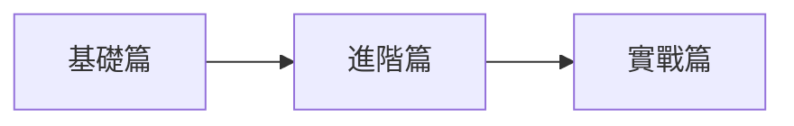

# Python 課程總覽

歡迎來到 **Python 教學講義**！這是一份從基礎到實戰的完整 Python 學習教材。

## 關於本課程

本課程適合 **完全初學者** 以及 **想系統性複習 Python** 的開發者。我們採用循序漸進的方式，從最基本的語法開始，逐步深入到實際應用。

### 課程特色

- **結構清晰** — 每章節都有明確的學習目標
- **範例驅動** — 大量的程式碼範例幫助理解
- **實戰導向** — 涵蓋真實開發場景的主題
- **持續更新** — 內容會隨著 Python 版本演進而更新

## 學習路徑

### [🐍 基礎篇](/python/basics/)

適合完全初學者，從零開始建立 Python 程式設計的基礎能力。

| 章節 | 主題 | 預計時間 |
|------|------|---------|
| 01 | 環境安裝與設定 | 30 分鐘 |
| 02 | 變數與資料型別 | 1 小時 |
| 03 | 流程控制 | 1.5 小時 |
| 04 | 函式 | 1.5 小時 |
| 05 | 資料結構 | 2 小時 |
| 06 | 字串處理 | 1 小時 |

### [⚡ 進階篇](/python/intermediate/)

已具備基礎程式概念，進一步學習 Python 的進階特性。

| 章節 | 主題 | 預計時間 |
|------|------|---------|
| 01 | 物件導向程式設計 | 2 小時 |
| 02 | 模組與套件 | 1 小時 |
| 03 | 錯誤與例外處理 | 1 小時 |
| 04 | 檔案 I/O | 1.5 小時 |
| 05 | 迭代器與生成器 | 1.5 小時 |

### [🚀 實戰篇](/python/advanced/)

將所學知識應用於真實專案，培養獨立開發能力。

| 章節 | 主題 | 預計時間 |
|------|------|---------|
| 01 | 網路爬蟲 | 2 小時 |
| 02 | 資料庫操作 | 2 小時 |
| 03 | Web API 開發 | 2.5 小時 |
| 04 | 資料科學入門 | 2 小時 |
| 05 | 自動化腳本 | 1.5 小時 |

---

## 開始之前

你需要準備：

1. **一臺電腦**（Windows / macOS / Linux 皆可）
2. **基本的電腦操作能力**
3. **一顆學習的心** ❤️

準備好了嗎？讓我們從 [**環境安裝**](/python/basics/01-環境安裝) 開始吧！
