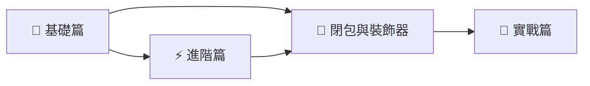

# Python 課程總覽

歡迎來到 **Python 教學講義**！這是一份從基礎到實戰的完整 Python 學習教材。

## 關於本課程

本課程適合 **完全初學者** 以及 **想系統性複習 Python** 的開發者。我們採用循序漸進的方式，從最基本的語法開始，逐步深入到實際應用。

### 課程特色

- **結構清晰** — 每章節都有明確的學習目標
- **範例驅動** — 大量的程式碼範例幫助理解
- **實戰導向** — 涵蓋真實開發場景的主題
- **持續更新** — 內容會隨著 Python 版本演進而更新

## 學習路徑

### [🐍 基礎篇](/python/basics/)

適合完全初學者，從零開始建立 Python 程式設計的基礎能力。

| 章節 | 主題 | 預計時間 |
|------|------|---------|
| 01 | 環境安裝與設定（含 Colab） | 30 分鐘 |
| 02 | 變數與資料型別 | 1 小時 |
| 03 | 流程控制 | 1.5 小時 |
| 04 | 函式 | 1.5 小時 |
| 05 | 資料結構（含淺／深拷貝） | 2.5 小時 |
| 06 | 字串處理 | 1 小時 |

### [⚡ 進階篇](/python/intermediate/)

已具備基礎程式概念，進一步學習 Python 的進階特性。

| 章節 | 主題 | 預計時間 |
|------|------|---------|
| 01 | 物件導向程式設計 | 2 小時 |
| 02 | 模組與套件 | 1 小時 |
| 03 | 錯誤與例外處理 | 1 小時 |
| 04 | 檔案 I/O | 1.5 小時 |
| 05 | 迭代器與生成器 | 1.5 小時 |
| 06 | 閉包（Closure） | 1 小時 |
| 07 | 裝飾器（Decorator） | 1.5 小時 |
| 08 | 關聯、組合與聚合 | 1 小時 |

### [🚀 實戰篇](/python/advanced/)

將所學知識應用於真實專案，培養獨立開發能力。

| 章節 | 主題 | 預計時間 |
|------|------|---------|
| 01 | 網路爬蟲 | 2 小時 |
| 02 | 資料庫操作 | 2 小時 |
| 03 | Web API 開發 | 2.5 小時 |
| 04 | 資料科學入門 | 2 小時 |
| 05 | 自動化腳本 | 1.5 小時 |
| 06 | 執行緒與並行程式設計 | 2 小時 |
| 07 | ITS Python 認證準備 | 2 小時 |

### [🧠 演算法與資料結構](/python/algorithms/)

適合準備程式競賽、技術檢定與面試，深入學習經典演算法與資料結構。

| 章節 | 主題 |
|------|------|
| 01 | 程式設計基礎（快速 I/O、型別轉換） |
| 02 | 資料結構：雜湊表（Hash Table） |
| 03 | 搜尋法（二分、插補、回溯） |
| 04 | 排序演算法（10+ 種排序） |
| 05 | 佇列（Queue） |
| 06 | 堆疊（Stack）與運算式 |
| 07 | 排列組合 |
| 08 | 樹（Tree）— 二元樹、DFS/BFS、Heap、MST |
| 09 | 進位轉換 |
| 10 | 迷宮問題 |
| 11 | 遞迴（Queen、數獨、河內塔） |
| 12 | 圖形最短路徑（Dijkstra、Bellman-Ford、Floyd-Warshall） |
| 13 | 動態規劃（LIS、LCS、背包問題） |
| 14 | 進階模組（collections、itertools 等） |
| 15 | 其他主題（質數、SPF、布林代數） |

### [🧩 解題技巧與經典問題](/python/problem-solving/)

適合進階學習，涵蓋正規表示式、鏈結串列、進階 DP、回溯法、字串演算法進階、二元樹進階與運算式轉換等主題。

| 章節 | 主題 |
|------|------|
| 01 | 正規表示式（Regular Expressions） |
| 02 | 鏈結串列（Linked List） |
| 03 | 字串演算法進階（編輯距離、迴文子序列、樣式比對） |
| 04 | 進階動態規劃（Kadane、House Robber、戳汽球） |
| 05 | 回溯法進階（N 皇后、Knight's Tour、Word Search） |
| 06 | 二維陣列與圖論（水池問題、最長遞增路徑） |
| 07 | 二元樹進階（LCA、直徑、AVL、N 元樹） |
| 08 | 運算式與括號（前/中/後置轉換、括號生成） |

---

## 開始之前

你需要準備：

1. **一臺電腦**（Windows / macOS / Linux 皆可）
2. **基本的電腦操作能力**
3. **一顆學習的心** ❤️

準備好了嗎？讓我們從 [**環境安裝**](/python/basics/01-環境安裝) 開始吧！
