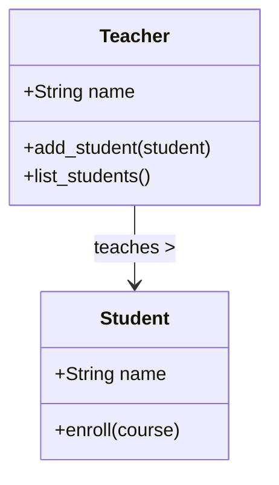
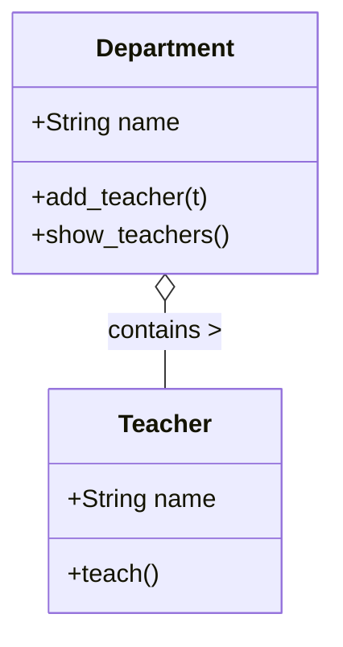
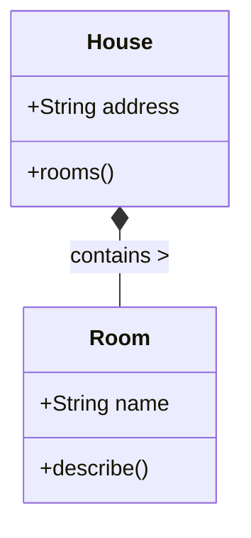

# 08 - 關聯、組合與聚合（物件關係）

---

## 🎯 學習目標

完成本章後，你將能夠：

- 理解「物件導向三大關係」：關聯、組合、聚合
- 區分「弱擁有」（聚合）與「強擁有」（組合）的生命週期差異
- 在 Python 中以 constructor、method、property 實作各類關係
- 判斷何時使用關聯／組合／聚合 vs 繼承
- 掌握生命週期管理（lifecycle management）的基本模式

---

## 1. 為什麼需要學習物件關係？

真實世界的物件幾乎不獨立存在——**老師**與**學生**之間有授課關係，**部門**包含多位**老師**，**房子**由多個**房間**組成。只用「繼承」無法描述這些「擁有」或「使用」的連結。

物件導向提供三種核心關係，讓你用程式碼映照真實世界的結構：

| 關係 | 口訣 | 強度 |
|------|------|------|
| 關聯（Association） | 「知道對方」 | 弱 🔗 |
| 聚合（Aggregation） | 「擁有，但各自活」 | 中 🧩 |
| 組合（Composition） | 「擁有，同生共死」 | 強 ⛓️ |

> 💡 **先備知識**：建議先複習 [01-物件導向程式設計](./01-物件導向.md)，確認你已掌握 class、`__init__`、method 與繼承的基本概念。

---

## 2. 關聯（Association）—「知道對方」

### 2.1 定義

**關聯**描述兩個**獨立**物件之間的使用關係。雙方各有自己的生命週期，沒有人「擁有」另一個人。

- 耦合度最低（loose coupling）
- 典型例子：**老師**知道哪些**學生**選修他的課

### 2.2 結構圖



### 2.3 Python 實作

```python
class Student:
    def __init__(self, name: str):
        self.name = name
        self.courses = []  # 學生選課清單

    def enroll(self, course: str):
        self.courses.append(course)


class Teacher:
    def __init__(self, name: str):
        self.name = name
        self._students = []  # 內部儲存關聯物件

    def add_student(self, student: Student):
        """透過 method 建立關聯"""
        self._students.append(student)

    @property
    def students(self) -> list[Student]:
        """property 暴露關聯物件（唯讀）"""
        return list(self._students)


# --- 使用範例 ---
t = Teacher("陳老師")
s1 = Student("小明")
s2 = Student("小華")

t.add_student(s1)
t.add_student(s2)

for stu in t.students:
    print(stu.name)  # 小明  小華
```

**關鍵觀察**：
- `Teacher` 與 `Student` 各自獨立建立
- `Teacher` 刪除後，`Student` 依然存在
- 關聯透過 method（`add_student`）建立，而非 constructor

---

## 3. 聚合（Aggregation）—「擁有，但各自活」

### 3.1 定義

**聚合**是「弱擁有」（weak has-a）關係。容器物件擁有部分物件，但**部分可以脫離容器獨立存在**。

- 生命週期：部分 ≠ 容器
- 典型例子：**部門**擁有**老師**，但老師離職後依然存在

### 3.2 結構圖



**空心菱形**在白堊紀的 UML 中代表聚合（菱形在容器側）。

### 3.3 Python 實作

```python
class Teacher:
    def __init__(self, name: str):
        self.name = name

    def teach(self):
        return f"{self.name} 正在授課"


class Department:
    def __init__(self, name: str):
        self.name = name
        self._teachers: list[Teacher] = []  # 聚合：空容器開局

    def add_teacher(self, teacher: Teacher):
        """從外部「加入」已存在的 Teacher 物件"""
        self._teachers.append(teacher)

    def remove_teacher(self, teacher: Teacher):
        """老師離職，Teacher 物件依然存活"""
        self._teachers.remove(teacher)

    def show_teachers(self):
        return [t.name for t in self._teachers]


# --- 使用範例 ---
t1 = Teacher("王老師")
t2 = Teacher("林老師")

dept = Department("資訊工程系")
dept.add_teacher(t1)
dept.add_teacher(t2)

print(dept.show_teachers())  # ['王老師', '林老師']

# 即使部門解散…
del dept
print(t1.teach())  # 王老師 正在授課  ← 老師依然存在！
```

**聚合 vs 關聯的關鍵差異**：

| | 關聯 | 聚合 |
|---|---|---|
| 語意 | 「使用」 | 「擁有」 |
| 生命週期相依 | 無 | 弱（部分獨立） |
| 典型實作 | method 傳入 | method 傳入，容器持有 |

---

## 4. 組合（Composition）—「擁有，同生共死」

### 4.1 定義

**組合**是「強擁有」（strong has-a）關係。部分物件的生命週期**完全依附**於容器——容器摧毀，部分隨之消滅。

- 生命週期：部分 = 容器
- 典型例子：**房子**由**房間**組成；房子拆除，房間也不存在

### 4.2 結構圖



**實心菱形**代表組合。

### 4.3 Python 實作

```python
class Room:
    def __init__(self, name: str):
        self.name = name

    def describe(self):
        return f"這是一個 {self.name}"


class House:
    def __init__(self, address: str):
        self.address = address
        # 🔴 組合：在建構子中建立 Room 物件
        self._rooms = [
            Room("客廳"),
            Room("廚房"),
            Room("臥室"),
        ]

    @property
    def rooms(self) -> list[Room]:
        return list(self._rooms)


# --- 使用範例 ---
house = House("台北市大安區忠孝東路100號")

for room in house.rooms:
    print(room.describe())
# 這是一個 客廳
# 這是一個 廚房
# 這是一個 臥室

# 當 house 被回收，_rooms 內的 Room 也無法再被存取
del house
```

**組合 vs 聚合的關鍵差異**：

| | 聚合 | 組合 |
|---|---|---|
| 菱形 | 空心 | 實心 |
| 部分建立時機 | 外部建立後傳入 | 容器建構子內部建立 |
| 生命週期 | 部分可獨立存活 | 部分隨容器消滅 |
| 暴露建構子 | 部分有自己的 public `__init__` | 通常部分只由容器建立 |

---

## 5. 生命週期管理（Lifecycle Management）

組合與聚合的核心差異來自**誰控制物件的建立與銷毀**。

### 5.1 組合模式（Container 掌控一切）

```python
class Engine:
    def start(self):
        return "引擎啟動"

class Car:
    def __init__(self):
        self._engine = Engine()          # 🔴 Car 建立 Engine

    @property
    def engine(self):
        return self._engine

# Car 被刪除 → Engine 也無法被外部存取
```

### 5.2 聚合模式（外部注入）

```python
class Engine:
    def __init__(self, hp: int):
        self.hp = hp

class Car:
    def __init__(self, engine: Engine):  # 🟡 Engine 從外部傳入
        self._engine = engine

    @property
    def engine(self):
        return self._engine

# Engine 可以裝到另一台車，或單獨存在
```

### 5.3 `__del__` 與 `weakref`（進階）

Python 的垃圾回收（GC）自動處理記憶體，但組合語意可以透過 `__del__` 明確表達：

```python
class Room:
    def __del__(self):
        print(f"{self.name} 已拆除")

class House:
    def __init__(self, addr):
        self.address = addr
        self._rooms = [Room("客廳"), Room("臥室")]

    def __del__(self):
        print(f"{self.address} 的房子已拆除")
        # Python GC 自動回收 _rooms

house = House("忠孝東路100號")
del house
# 輸出：
# 忠孝東路100號 的房子已拆除
# 客廳 已拆除
# 臥室 已拆除
```

> ⚠️ `__del__` 在 Python 中不保證立即呼叫（CPython 參考計數歸零時才觸發）。不要依賴它管理重要資源——請使用 context manager（`with`）或 `close()`。

---

## 6. 關聯 vs 聚合 vs 組合 — 比較總表

| 面向 | 關聯（Association） | 聚合（Aggregation） | 組合（Composition） |
|------|---------------------|---------------------|---------------------|
| UML 符號 | `-->`（箭頭） | `o--`（空心菱形） | `*--`（實心菱形） |
| 強度 | 弱 | 中 | 強 |
| 擁有語意 | ❌ 只是使用 | ✅ 弱擁有 | ✅ 強擁有 |
| 生命週期相依 | 無 | 部分獨立 | 部分依附容器 |
| 部分建構時機 | — | 外部 | 容器建構子內 |
| 典型實作 | method 參數 | method 參數 | constructor 內部 `new` |
| Python 範例 | `Teacher ↔ Student` | `Department → Teacher` | `House → Room` |

### 6.1 與繼承（Inheritance）的選擇

| 情境 | 用繼承 | 用關聯／組合／聚合 |
|------|--------|--------------------|
| 「A **是** B」 | ✅ `class Dog(Animal)` | ❌ |
| 「A **擁有** B」 | ❌ | ✅ `class Car:` → `self.engine` |
| 「A **使用** B」 | ❌ | ✅ `def teach(self, student)` |
| 需要共用介面／行為 | ✅ | ❌（但要考慮 composition over inheritance） |

**黃金原則**：**優先使用組合，而不是繼承**（*Favor composition over inheritance*）。除非你能說出「X 是一種 Y」，否則就用關聯／聚合／組合。

---

## 7. 決策指南

當你需要連結兩個類別時，依序問自己三個問題：

```
步驟 1：A 會「使用」B 嗎？
    ├─ 只是暫時知道 → 關聯（method 參數）
    └─ 需要長期持有 → 到步驟 2

步驟 2：A 刪除後，B 應該繼續存在嗎？
    ├─ 應該 → 聚合（外部注入）
    └─ 不應該 → 到步驟 3

步驟 3：B 能獨立存在嗎？
    ├─ 可以 → 聚合（語意上偏弱擁有）
    └─ 不可以 → 組合（建構子內建立）
```

**速查表**：

| 你的句子 | 關係 |
|----------|------|
| 「老師**知道**學生的成績」 | 關聯 |
| 「部門**擁有**老師」 | 聚合 |
| 「老師**教**學生」 | 關聯 |
| 「房子**有**房間」 | 組合 |
| 「訂單**包含**商品明細」 | 組合 |
| 「圖書館**收藏**書籍」 | 聚合（書可以存在其他地方） |

---

## 8. 進階議題

### 8.1 雙向關聯（Bidirectional Association）

有時雙方都需要知道對方，例如 `Student` 知道自己選了哪些 `Course`，`Course` 也知道哪些學生選修。

```python
class Course:
    def __init__(self, name: str):
        self.name = name
        self._students: list[Student] = []

    def add_student(self, student: "Student"):
        self._students.append(student)
        student._courses.append(self)  # 雙向綁定


class Student:
    def __init__(self, name: str):
        self.name = name
        self._courses: list[Course] = []

    @property
    def courses(self):
        return list(self._courses)
```

> ⚠️ 雙向關聯要小心**循環參考**，必要時使用 `weakref`。

### 8.2 組合的深拷貝 vs 淺拷貝

組合物件被複製時，部分物件通常也該被複製（**深拷貝**）。

```python
import copy

room = Room("書房")
house1 = House("地址A")
house1._rooms.append(room)

house2 = copy.deepcopy(house1)   # 房間也一起複製
house2._rooms[0].name = "遊戲房"  # 不影響 house1
```

聚合通常只需要**淺拷貝**，因為部分物件共享。

---

## 9. 練習題

### 🟢 初級

**Problem 1：實作關聯 — Library 與 Book**

`Library` 提供 `add_book(book)`、`list_books()`，`Book` 只需要有 `title`。兩者各自獨立。

```python
class Book:
    def __init__(self, title: str):
        self.title = title

class Library:
    def __init__(self, name: str):
        self.name = name
        self._books = []          # ← 請完成

    def add_book(self, book):     # ← 請完成
        ...

    def list_books(self):         # ← 請完成
        ...
```

**難點提示**：思考參數型態註記 `-> list[Book]` 該怎麼寫。

---

**Problem 2：實作聚合 — Team 與 Player**

`Team` 可以 `add_player(p)`、`remove_player(p)`，球員被移除後依然存在。

```python
class Player:
    def __init__(self, name: str, position: str):
        self.name = name
        self.position = position

class Team:
    def __init__(self, name: str):
        self.name = name
        self._players = []          # ← 聚合容器

    def add_player(self, player):   # ← 請完成
        ...

    def remove_player(self, player): # ← 請完成
        ...

    @property
    def players(self):              # ← 請完成
        ...
```

---

### 🟡 中級

**Problem 3：實作組合 — Blog 與 Post**

`Blog` 建立時自動建立空的 `Post` 列表；`add_post(title, content)` 在 Blog 內部建立 `Post`；`Blog` 刪除時 `Post` 也無法使用。

```python
class Post:
    def __init__(self, title: str, content: str):
        self.title = title
        self.content = content

class Blog:
    def __init__(self, name: str):
        self.name = name
        self._posts = []              # ← 請思考：為什麼是組合？

    def add_post(self, title: str, content: str) -> Post:  # ← 請完成
        ...
```

**思考題**：如果外部呼叫 `blog.add_post("A", "aaa")` 後又 `del blog`，那個 `Post` 物件還能被存取嗎？

---

### 🔴 高級

**Problem 4：整合 — School System**

請實作一個小型學校系統，包含以下類別與關係：

| 類別 | 關係說明 |
|------|----------|
| `School` | 組合 `Department`（學校倒閉，科系消失） |
| `Department` | 聚合 `Teacher`（老師可轉到其他學校） |
| `Teacher` | 關聯 `Student`（老師知道哪些學生修課） |
| `Student` | 關聯 `Course`（學生知道自己選了哪些課） |

請至少實作：
- `School.__init__(name)` → 內部建立三個 `Department`
- `Department.add_teacher(t)` / `remove_teacher(t)`
- `Teacher.add_student(s)` / `Teacher.students` property
- `Student.enroll(course)` / `Student.courses` property

```python
class School:
    def __init__(self, name: str):
        self.name = name
        # 組合：School 內部建立 Department
        self._departments = [
            Department("資訊工程"),
            Department("電機工程"),
            Department("數學"),
        ]

    @property
    def departments(self):
        return list(self._departments)


class Department:
    def __init__(self, name: str):
        self.name = name
        self._teachers: list[Teacher] = []   # 聚合

    def add_teacher(self, teacher):    # ← 請完成
        ...

    def remove_teacher(self, teacher): # ← 請完成
        ...

    @property
    def teachers(self):                # ← 請完成
        ...


class Teacher:
    def __init__(self, name: str):
        self.name = name
        self._students: list[Student] = []  # 關聯

    def add_student(self, student):    # ← 請完成
        ...

    @property
    def students(self):                # ← 請完成
        ...


class Student:
    def __init__(self, name: str):
        self.name = name
        self._courses: list[str] = []  # 簡單用字串

    def enroll(self, course: str):     # ← 請完成
        ...

    @property
    def courses(self):                 # ← 請完成
        ...
```

---

## 10. 重點整理

> **📌 三個問題，決定三種關係**

```
關聯  →  A 只是「使用」B
聚合  →  A「擁有」B，但 B 自己會活
組合  →  A「擁有」B，B 跟著 A 生死
```

- **關聯**：最鬆散，透過 method 參數建立（`Teacher.add_student(s)`）
- **聚合**：容器持有外部建立的物件，雙方生命週期獨立
- **組合**：容器在建構子內建立部分物件，生命週期同步
- Python 沒有 `public/private` 關鍵字，使用 `_name` 約定表示內部屬性
- 用 `@property` 暴露內部集合，避免外部直接修改
- **優先使用組合，而不是繼承**——這是物件導向設計最重要的原則之一
- Mermaid 圖中的箭頭與菱形幫助溝通設計，但最終還是看生命週期掌控權

---

> 下一章將探討 **SOLID 原則**，了解如何使用單一職責原則與開放封閉原則來設計更好的物件導向程式。
