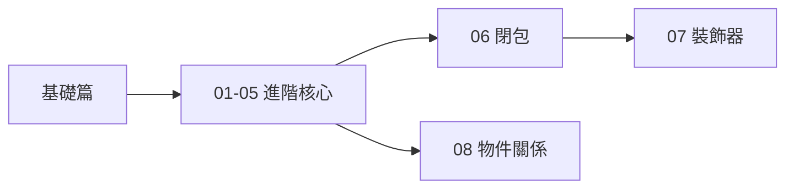

# ⚡ 進階篇

歡迎來到 Python 進階篇！在打下基礎之後，本篇章將帶你探索 Python 更多強大的特性與程式設計的重要觀念。

## 學習目標

完成本篇章後，你將能夠：

- ✅ 使用類別與物件進行物件導向程式設計
- ✅ 管理 Python 模組與第三方套件
- ✅ 妥善處理程式中的錯誤與例外
- ✅ 讀寫檔案與處理各種 I/O 操作
- ✅ 使用迭代器與生成器處理大量資料
- ✅ 理解閉包與裝飾器的運作原理
- ✅ 設計物件之間的關聯、組合與聚合關係

## 章節列表

### [01 - 物件導向程式設計](./01-物件導向)
理解類別（class）與物件（object）的概念，學習封裝、繼承、多型等 OOP 特性。

### [02 - 模組與套件](./02-模組與套件)
學習如何組織程式碼、匯入模組、使用 PyPI 第三方套件，以及建立自己的套件。

### [03 - 錯誤與例外處理](./03-錯誤處理)
掌握 `try`/`except`/`finally` 區塊、自訂例外類別，以及撰寫穩健程式的技巧。

### [04 - 檔案 I/O](./04-檔案IO)
學習讀寫文字檔與二進位檔、使用 `with` 語句、處理 CSV 與 JSON 格式資料。

### [05 - 迭代器與生成器](./05-迭代器與生成器)
深入理解迭代協議、使用 `yield` 建立生成器、以及記憶體友善的資料處理方式。

### [06 - 閉包（Closure）](./06-閉包)
理解閉包的運作機制，掌握內部函式捕獲外部變數的技術以及 `nonlocal` 關鍵字的使用。

### [07 - 裝飾器（Decorator）](./07-裝飾器)
學習裝飾器的語法與實作，從計時器到快取，掌握 AOP 風格的函式增強技巧。

### [08 - 關聯、組合與聚合](./08-關聯組合聚合)
探討物件之間的三種關係：關聯、組合與聚合，學習如何在 OOP 設計中選擇合適的關係。

---

## 學習路徑

## 預備知識

建議先完成 **基礎篇** 的所有章節，熟悉 Python 基本語法後再進入本篇章。

> 💡 **小提醒**：進階篇的概念較為抽象，建議實際撰寫範例程式來加深理解。
